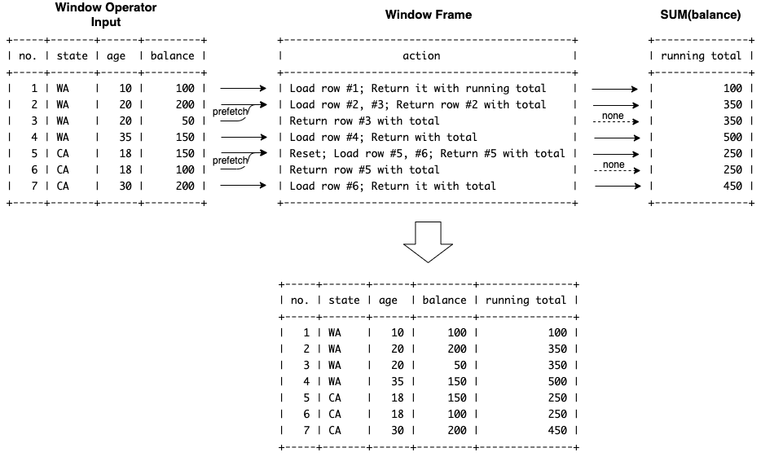

# SQL Aggregate Window Functions

## 1.Overview

To support aggregate window functions, the following two problems need to be addressed:

1. How to make existing aggregate functions work as window function
2. How to handle duplicate sort key (field values in ORDER BY, will elaborate shortly)

For the first problem, a wrapper class AggregateWindowFunction is created. In particular, it extends Expression interface and reuse existing aggregate functions to calculate result based on window frame. **Now let’s examine in details how to address the second problem**.


## 2.Problem Statement

First let’s check why it’s a problem to the window frame and ranking window function framework introduced earlier. In the following example, `age` as sort key in `ORDER BY age` is unique, so the running total is accumulated on each row incrementally.

```
mysql> SELECT
    ->  ROW_NUMBER() OVER () AS "no.",
    ->  state, age, balance,
    ->  SUM(balance) OVER (PARTITION BY state ORDER BY age) AS "running total"
    -> FROM accounts
    -> ORDER BY state DESC, age;
+-----+-------+------+---------+---------------+
| no. | state | age  | balance | running total |
+-----+-------+------+---------+---------------+
|   1 | WA    |   10 |     100 |           100 |
|   2 | WA    |   20 |     200 |           300 |
|   3 | WA    |   25 |      50 |           350 |
|   4 | WA    |   35 |     150 |           500 |
|   5 | CA    |   18 |     150 |           150 |
|   6 | CA    |   25 |     100 |           250 |
|   7 | CA    |   30 |     200 |           450 |
+-----+-------+------+---------+---------------+
```

However, problem arises when the sort key has duplicate values. For example, the 2nd and 3rd row (called peers) in ‘WA’ partition has same value. Same for the 5th and 6th row in the ‘CA’ partition. In this case, the running total would be the same for peer rows. This looks strange at first sight, though the reason is **the fact that which row is current is defined by sort key. That’s why the existing window frame and function implementation only based on and access to current row won’t work.**

```
mysql> SELECT
    ->  ROW_NUMBER() OVER () AS "no.",
    ->  state, age, balance,
    ->  SUM(balance) OVER (PARTITION BY state ORDER BY age) AS "running total"
    -> FROM accounts
    -> ORDER BY state DESC, age;
+-----+-------+------+---------+---------------+
| no. | state | age  | balance | running total |
+-----+-------+------+---------+---------------+
|   1 | WA    |   10 |     100 |           100 |
|   2 | WA    |   20 |     200 |           350 |
|   3 | WA    |   20 |      50 |           350 |
|   4 | WA    |   35 |     150 |           500 |
|   5 | CA    |   18 |     150 |           250 |
|   6 | CA    |   18 |     100 |           250 |
|   7 | CA    |   30 |     200 |           450 |
+-----+-------+------+---------+---------------+
```

## 3.Solution

### 3.1 How It Works

By the examples above, we should be able to understand what an aggregate window function does conceptually. To implement, first we need to figure out how aggregate window functions work from iterative thinking. Let’s review the previous example and imagine a query engine behind it doing the calculation.

```
+-----+-------+------+---------+---------------+
| no. | state | age  | balance | running total |
+-----+-------+------+---------+---------------+ <- initial state
|   1 | WA    |   10 |     100 |           100 | <- load 100, return 100 as sum
|   2 | WA    |   20 |     200 |           350 | <- load 200 and 50, return 350
|   3 | WA    |   20 |      50 |           350 | <- load nothing, return 350 again
|   4 | WA    |   35 |     150 |           500 | <- load 150, return 500
|   5 | CA    |   18 |     150 |           250 | <- new partition, reset and load 100 and 150
|   6 | CA    |   18 |     100 |           250 | <- load nothing, return 250 again
|   7 | CA    |   30 |     200 |           450 | <- load 200, return 450
+-----+-------+------+---------+---------------+ <- no more data, done
```

### 3.2 Design

To explain the design in more intuitive way, formal sequence diagram in UML is not present here. Instead the following informal diagram illustrates how `WindowOperator`, `PeerRowsWindowFrame` and `AggregateWindowFunction` component work together as a whole to implement the same logic in last section.



### 3.3 Performance

For time complexity, aggregate window functions are same as ranking functions which only scan input linearly. However, as for space complexity, there seems no way to avoid this memory consumption. Because more rows needs to be pre-fetched for calculation and meanwhile window operator need access to each previous row, one by one, as output.

In the worst case, all input data will be pulled out into window frame if:

1. Single partition due to no PARTITION BY clause
2. (and) All values of ORDER BY fields are exactly the same

In this case, circuit breaker needs to be enabled to protect window operator from consuming large memory.
