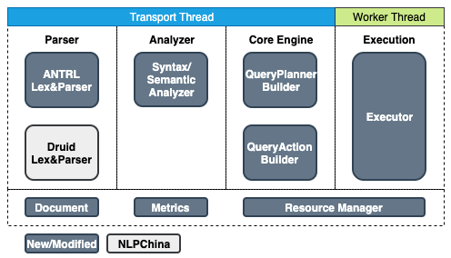
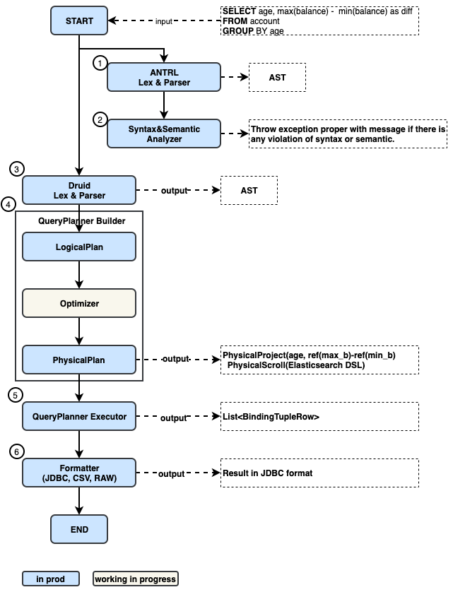

# OpenDistro SQL Engine Architecture

---
## 1.Overview

The OpenDistro SQL (OD-SQL) project is developed based on NLPChina project (https://github.com/NLPchina/elasticsearch-sql) which has been deprecated now ([attributions](https://github.com/opendistro-for-elasticsearch/sql/blob/master/docs/attributions.md)). Over the one year in development, a lot of features have been added to the OD-SQL project on top of the existing older nlp-china project. The purpose of this document is to explain the OD-SQL current architecture going ahead.

---
## 2.High Level View

In the high level, the OD-SQL Engine could be divided into four major sub-module.

* *Parser*: Currently, there are two Lex&Parser coexists. The Druid Lex&Parser is the original one from NLPChina. The input AST of Core Engine is from the Druid Lex&Parser. The [ANTLR](https://github.com/opendistro-for-elasticsearch/sql/blob/master/src/main/antlr/OpenDistroSqlParser.g4) Lex&Parser is added by us to customized the verification and exception handling.
* *Analyzer*: The analyzer module take the output from ANTLR Lex&Parser then perform syntax and semantic analyze.
* *Core Engine*: The QueryAction take the output from Druid Lex&Parser and translate to the Elasticsearch DSL if possible. This is an NLPChina original module. The QueryPlanner Builder is added by us to support the JOIN and Post-processing logic. The QueryPlanner will take the take the output from Druid Lex&Parser and build the PhysicalPlan
* *Execution*: The execution module execute QueryAction or QueryPlanner and return the response to the client. Different from the Frontend, Analyzer and Core Engine which running on the Transport Thread and can’t do any blocking operation. The Execution module running on the client threadpool and can perform the blocking operation.

There are also others modules include in the OD-SQL engine.

* _Documentation_: it is used to auto-generated documentation.
* _Metrics_: it is used to collect OD-SQL related metrics.
* _Resource Manager_:  it is used to monitor the memory consumption when performing join operation to avoid the impact to Elasticsearch availability.

---
## 3.Journey of the query in OD-SQL engine.

The following diagram take a sample query and explain how the query flow within different modules.

1. The ANTRL parser based on grammar file (https://github.com/opendistro-for-elasticsearch/sql/blob/master/src/main/antlr/OpenDistroSqlParser.g4) to auto generate the AST. 
2. The Syntax and Semantic Analyzer will walk through the AST and verify whether the query is follow the grammar and supported by the OD-SQL. e.g. *SELECT * FROM semantics WHERE LOG(age, city) = 1, *will throw exception with message* Function [LOG] cannot work with [INTEGER, KEYWORD]. *and sample usage message* Usage: LOG(NUMBER T) → DOUBLE.
3. The Druid Lex&Parser takes the input query and generate the druid AST which is different from the AST generated by the ANTRL. This module is the open source library (https://github.com/alibaba/druid) used by NLPChina originally.
4. The QueryPlanner Builder take the AST as input and generate the LogicalPlan from it. Then it optimize the LogicalPlan to PhysicalPlan.(In current implementation, only rule-based model is implemented). The major part of PhysicalPlan generation use NLPChina’s original logic to translate the SQL expression in AST to Elasticsearch DSL.
5. The QueryPlanner executor execute the PhysicalPlan in worker thread.
6. The formatter will reformatted the response data to the required format. The default format is JDBC format.

