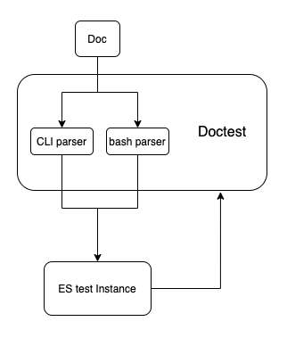
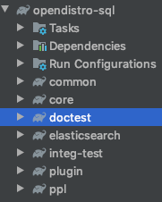

# Doctest

# 1. Overview

## 1.1 What is doctest?

Doctest is a way to test code by checking the correctness of embedded interactive examples in documentation
[example explaining doctest module](https://docs.python.org/3/library/doctest.html#simple-usage-checking-examples-in-a-text-file)

`example.txt`

```
This is an example text file in reStructuredText format.  First import
``factorial`` from the ``example`` module:

    **>>> from example import factorial**

Now use it:

    **>>> factorial(6)
    120**
```


Running `doctest.testfile("example.txt")` then finds the error

```
File "./example.txt", line 14, in example.txt
Failed example:
    factorial(6)
Expected:
    120
Got:
    720
```

## 1.2 Why use doctest? 

Doctest can make the code snippet in docs executable, and check its response as well.

As mentioned in the python doctest [introduction](https://docs.python.org/3/library/doctest.html#), doctest has grown to have three primary uses:

1. Checking examples in docstrings.
2. Regression testing.
3. Executable documentation / literate testing.

## 1.3 How does it affect unit/integration testing suite?

Both doctest and unit/integration test are valuable. Use doctest for cases where the test is giving an example of usage that is actually useful as documentation. Generally, don't make these tests comprehensive, aiming solely for informative. Use doctest in reverse: **not to test the code is correct based on doctest, but to check that documentation is correct based on the code.**

For actually testing the code, the goal is to thoroughly test every case, rather than illustrate what it does by example. Doctests aren't meant to be a comprehensive testing solution - they're meant to ensure that simple interactive-prompt style examples in your documentation (including docstrings) don't get out of date.

## 1.4 How to use doctest?
### 1.4.2 How to run existing doctest?
Doctest runs with project build by `./gradlew build`. You can also only run doctest by `./gradlew doctest`

Make sure you don't have any Elasticsearch instance running at `http://localhost:9200`

### 1.4.2 How to write documentation with doctest?
1. If you want to add a new doc, you can add it to `docs` folder, under correct sub-folder, in `.rst` format. 
> **Attention**: For code examples in documentation, a Mixing usage of `cli` and `bash` in one doc is not supported yet.
2. Add your new doc file path to `docs/category.json` by its category
3. Run doctest `./gradlew doctest` to see if your tests can pass

Currently, there is a `sample` folder under `docs` module to help you get started.

## 1.5 Future Plan

Current SQL Documentation will need reconstruction in the future. Ideally, both SQL and PPL doctest will integrate/migrate to a separate Doctest module in the new architecture. 

# 2. Design

## 2.1 Workflow




## 2.2 ES Test Instance

### 2.2.1 Testing framework

We have two options here

1. Use ES integration testing framework, same as SQL Plugin integration test.
2. Spin up ES instance with SQL Plugin installed without gradle build the package, simply `./gradlew run`


The reason we are not using ES test framework, is due to the difficulty of integrating Python code to a Java based framework, considering we are using python built-in module `doctest` for implementation

### 2.2.2 Gradle

1. Create new module/packdage `doctest` under current `opendistro-sql`, and integrate to gradle management
    1. 

2. Set up gradle build script, which enables doctest by `./gradlew doctest`
3. Gradle tasks:
    1. bootstrap
    2. StartES
        1. ` ./gradlew run`
        2. https://github.com/elastic/elasticsearch/blob/master/TESTING.asciidoc#running-elasticsearch-from-a-checkout
    3. doctest
    4. StopES
4. Integrate Doctest to project gradle build, which means `./gradlew build` will also run `doctest`


### **2.2.3 Project Structure**

`bootstrap.sh`   set up virtual environment for python module

```
doctest
├── bin
│   └── test-docs
├── bootstrap.sh
├── build.gradle
├── docs
│   └── dql
│       ├── basics.rst
│       └── explain.rst
├── requirements.txt
├── test_data
│   └── accounts.json
└── test_docs.py
```


## 2.3 Parsers

> **How are Docstring Examples Recognized?**
In most cases, a copy-and-paste of an interactive console session works fine, but doctest isn’t trying to do an exact emulation of any specific Python shell.


Doctest is relying on the console/command line to run code examples in documentation. So we need two parsers here.


### 2.3.1 CLI parser

**Reference: [CrateDB Implementation](https://github.com/crate/crate/blob/master/blackbox/test_docs.py)**

* To recognize its own cli and bash, CrateDB customize the doctest parser by a 3rd party libary:  [zc.customdoctests](https://pypi.org/project/zc.customdoctests/)
* CrateDB doctest uses it’s own cli `crash` to run doctests. https://github.com/crate/crash
    * https://github.com/crate/crate/blob/master/docs/general/dql/selects.rst


Similar to CrateDB using it’s CLI “crash”, we can make use of our own [SQL-CLI](https://github.com/opendistro-for-elasticsearch/sql/tree/master/sql-cli)

To support PPL, we need to add PPL support to SQL-CLI. Since PPL and SQL expose similar http endpoint for query and share similar response format. The update won’t be much of work.

The code example in a doc using `CLI` should be like this

```
odfesql> SELECT firstname, lastname FROM accounts;
fetched rows / total rows = 4/4
+-------------+------------+
| firstname   | lastname   |
|-------------+------------|
| Amber       | Duke       |
| Hattie      | Bond       |
| Nanette     | Bates      |
| Dale        | Adams      |
+-------------+------------+
```


### 2.3.2 bash parser

1. Use [python subprocess](https://docs.python.org/3/library/subprocess.html) to run `curl` command
2. Need to add additional formatter to better display json response


The code example in a doc using `bash` should be like this

```
sh$ curl -XPOST "localhost:9200/_opendistro/_ppl/" 
          -H 'Content-Type: application/json' 
          -d'{  "query": "search source=kibana_sample_data_flights OriginCountry = "IT" 
          DestiContry = "US" | fields FlightNum, DestCountry, OriginCountry "}'
   
    {
      {
        "FlightNum": "ADGH12",
        "OriginCountry": "IT",
        "DestCountry": "US"
      },
      {
        "FlightNum": "IRMW49",
        "OriginCountry": "IT",
        "DestCountry": "US"
      },
      ...
    }
```


## 2.3 Test Data

Use elasticsearch python library to create connection to ES instance. It can load test data into ES instance, and delete test index after testing.

**Setup:** `bulk` API
**TearDown:** `delete(index=["<test_index>"])`


## 2.3 Test Report

### 2.3.1 Print results

Use python faulthandler from script to print results

https://docs.python.org/3/library/faulthandler.html

```
> Task :doctest:doctest
/Users/szhongna/Desktop/Projects/sql/doctest/docs/dql/basics.rst
Doctest: basics.rst ... ok
/Users/szhongna/Desktop/Projects/sql/doctest/docs/dql/explain.rst
Doctest: explain.rst ... FAIL

======================================================================
FAIL: /Users/szhongna/Desktop/Projects/sql/doctest/docs/dql/explain.rst
Doctest: explain.rst

----------------------------------------------------------------------
File "/Users/szhongna/Desktop/Projects/sql/doctest/docs/dql/explain.rst", line 6, in explain.rst
Failed example:
    pretty_print(sh("""curl -sS -H 'Content-Type: application/json' \
    -X POST localhost:9200/_opendistro/_sql/_explain \
    -d '{"query" : "SELECT firstname, lastname FROM accounts WHERE age > 20"}'
    """).stdout.decode("utf-8"))
Expected:
    {
      "from": 0,
      "size": 200,
      "query": {
       
       ... 
       
       }
    }
Got:
    {
      "from": 0,
      "size": 10,
      "query": {
      
        ... 
      
      }
    }


----------------------------------------------------------------------
Ran 2 tests in 2.963s

FAILED (failures=1)

> Task :doctest:doctest FAILED

FAILURE: Build failed with an exception.

```


### 2.3.2 generate report

* Python tests can’t be integrated to Jacoco test reporting
* TODO: need to figure out a better solution
