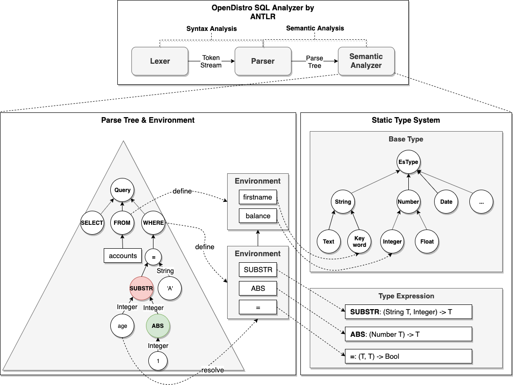
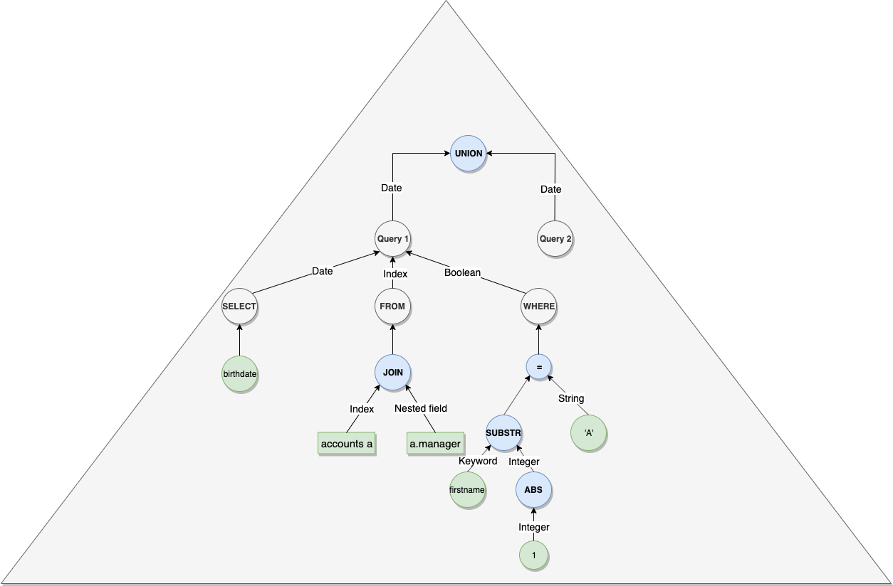

# Semantic Analysis

---
## 1.Overview

Previously SQL plugin didn't do semantic analysis, for example field doesn't exist, function call on field with wrong type etc. So it had to rely on Elasticsearch engine to perform the "check" which is actual execution. 
This led to bad user experience because of missing careful verification, cost of actual execution and confusing error message. In this work, we built a new semantic analyzer based on the new ANTLR generated parser introduced recently.
With the new semantic analyzer, we manage to perform various verification in terms of meaning of the query and return clear and helpful message to user for troubleshoot.

So in this work our initial goal is to add capability to perform basic semantic analysis including:

 1. Check field name and found if any typo.
 2. Check if function is in use with correct arguments.
 3. Apart from basic check above, it would be nice to do some simple check for JOIN, subquery and multi-query etc.

For both exception, we want to return useful message to customer and even suggest to change the wrong symbol to possibly right one.

---
## 2.Use Cases

Firstly, you could go through the following examples of semantic check with our new analyzer. In the use cases, you should be able to get a taste of what benefits the new semantic analyzer is bring to us:

### 2.1 Field Name Typo

```
POST _opendistro/_sql
{
  "query": "SELECT balace FROM accounts"
}

{
  "error": {
    "reason": "Invalid SQL query",
    "details": "Field [balace] cannot be found or used here. Did you mean [balance]?",
    "type": "SemanticAnalysisException"
  },
  "status": 400
}
```

### 2.2 Function Call on Incompatible Field Type

```
POST _opendistro/_sql
{
  "query": "SELECT * FROM accounts WHERE SUBSTRING(balance, 0, 1) = 'test'"
}

{
  "error": {
    "reason": "Invalid SQL query",
    "details": "Function [SUBSTRING] cannot work with [LONG, INTEGER, INTEGER]. Usage: SUBSTRING(STRING T, INTEGER, INTEGER) -> T",
    "type": "SemanticAnalysisException"
  },
  "status": 400
}
```

### 2.3 An index Join Non-nested Field

```
POST _opendistro/_sql
{
  "query": "SELECT * FROM accounts a, a.firstname"
}

{
  "error": {
    "reason": "Invalid SQL query",
    "details": "Operator [JOIN] cannot work with [INDEX, TEXT]. Usage: Please join index with other index or its nested field.",
    "type": "SemanticAnalysisException"
  },
  "status": 400
}
```

### 2.4 Wrong Reference in Subquery

```
POST _opendistro/_sql
{
  "query": "SELECT * FROM accounts a WHERE EXISTS (SELECT * FROM accounts b WHERE b.address LIKE 'Seattle') AND b.age > 10"
}

{
  "error": {
    "reason": "Invalid SQL query",
    "details": "Field [b.age] cannot be found or used here. Did you mean [a.age]?",
    "type": "SemanticAnalysisException"
  },
  "status": 400
}
```

### 2.5 Operator Use on Incompatible Field Type

```
POST _opendistro/_sql
{
  "query": "SELECT * FROM accounts WHERE lastname IS FALSE"
}

{
  "error": {
    "reason": "Invalid SQL query",
    "details": "Operator [IS] cannot work with [TEXT, BOOLEAN]. Usage: Please use compatible types from each side.",
    "type": "SemanticAnalysisException"
  },
  "status": 400
}
```

### 2.6 Subquery Return Incompatible Type

```
POST _opendistro/_sql
{
  "query": "SELECT * FROM accounts WHERE lastname IN (SELECT age FROM accounts)"
}

{
  "error": {
    "reason": "Invalid SQL query",
    "details": "Operator [IN] cannot work with [TEXT, LONG]. Usage: Please return field(s) of compatible type from each query.",
    "type": "SemanticAnalysisException"
  },
  "status": 400
}
```

### 2.7 Multi-query On Incompatible Type

```
POST _opendistro/_sql
{
  "query": "SELECT balance FROM accounts UNION ALL SELECT city FROM accounts"
}

{
  "error": {
    "reason": "Invalid SQL query",
    "details": "Operator [UNION] cannot work with [LONG, TEXT]. Usage: Please return field(s) of compatible type from each query.",
    "type": "SemanticAnalysisException"
  },
  "status": 400
}
```

---
## 3.High Level Design

The semantic analyzer consists of 2 core components: semantic context and type system.

### 3.1 Semantic Context

Semantic context manages Environment in a stack for scope management for nested subquery. Precisely, an Environment is the storage of symbols associated with its type. To perform analysis, looking up in the environments in the semantic context is first step. Only after determining the symbol exists and what's its type, further analysis like type checking can happen. We use the same terminology in compiler theory:

 * **Define**: stores symbol name along with its attribute (type only for now) to the current environment in context.
 * **Resolve**: looks up symbol name to find its attribute associated.

To avoid naming conflict, we need to introduce one more layer inside each environment - namespace. For example, it's supposed to be allowed to have field name or alias in SQL query which has the same name as built-in function such as `SUM`. To implement this, we divide each environment into 3 namespaces for better management:

 * **Field namespace**: field name loaded from index mapping.
 * **Function namespace**: built-in function names.
 * **Operator namespace**: mainly comparison operator such as `=`, `>`, `IS` etc.

Here is a simple diagram showing what Semantic Context looks like at runtime:


### 3.2 Type System

Type system allows for type check for all symbols present in the SQL query. First of all, we need to define what is type. Typically, type consists of 2 kinds:

 * **Base type**: is based on Elasticsearch data type and organized into hierarchy with "class" type internally.
    * **ES data type**: For example, INTEGER and LONG belongs to NUMBER, TEXT and KEYWORD belongs to STRING.
    * **ES index**: we also have specific type for index, index pattern and nested field.
 * **Type expression**: is expression of multiple base type as argument type along with a constructor, for example, array constructor can construct integer to integer array, struct constructor can construct couple of base type into a new struct type. Similarly, function and comparison operator accepts arguments and generate result type. 
    * **Function**: including scalar and aggregate function in SQL standard as well as functions for Elasticsearch. 
    * **Operator**: including comparison operator (=, <, >), set operator (UNION, MINUS) and join operator (JOIN).

But support for only simple type is not sufficient. The following special types needs to be covered:

 * **Generic type**: when we say `LOG(NUMBER) -> NUMBER` actually we want to return whatever input type (INTEGER, FLOAT) specifically instead of NUMBER.
 * **Vararg**: for example, function `CONCAT` can apply to arbitrary number of strings.
 * **Overloading**: function like `LOG` can have multiple specifications, one for not specifying base and another for base.
 * **Named argument**: most functions for Elasticsearch feature use named argument, for example `TOPHITS('size'=3,'age'='desc'`.
 * **Optional argument**: essentially this is same as function overloading.

Currently we can add support for Generic Type and Overloading. To clarify, function specification involved in generic type like `SUBSTRING(func(T(STRING), INTEGER, INTEGER).to(T))` is similar as that in Java `<T extends String> T Substring(T, int, int)`.
As for other unsupported feature, we use empty specification to convey the function exists in our type system but we want to skip type check for now. 

### 3.3 String Similarity

Apart from the core components above, another interesting part is the string similarity algorithm that provides suggestion when semantic analysis error occurred. Currently we make use of classic edit distance algorithm in Lucene library to guess a similar symbol when we suspect user put wrong name. That's why you can see the "Did you mean XXX?" in the examples in Use Cases section.


---
## 4.Detailed Design

Basically the components of semantic analysis works together in the manner shown in the following diagram:



### 4.1 Parse Tree Visitor

Parse Tree Visitor that walks through the SQL parse tree is driver of the whole semantic analysis process. So this section tries to make clear how Semantic Context, Type System and other parts work together by providing an example.
Suppose an index `accounts` has mapping as below:

```
"mappings": {
  "account": {
    "properties": {
      "age": {
        "type": "integer"
      },
      "city": {
        "type": "keyword"
      },
      "birthday": {
        "type": "date"
      },
      "employer": {
        "type": "text",
        "fields": {
          "keyword": {
            "type": "keyword",
            "ignore_above": 256
          }
        }
      },
      "projects": {
        "type": "nested",
        "properties": {
          "members": {
            "type": "nested",
            "properties": {
              "name": {
                "type": "text"
              }
            }
          },
          "active": {
            "type": "boolean"
          }
        }
      },
      "manager": {
        "properties": {
          "name": {
            "type": "text"
          }
        }
      }
    }
  }
}
``` 

Firstly, visitor needs to enforce the visiting order of SQL query. Because some clause like FROM is essentially the definition of symbol, it is required to be visited before other clause such as WHERE which is the resolution of symbol. Currently the visiting process is being performed in the following order:

 1. **FROM**: define all symbols in index mapping in context for later resolution
 2. **WHERE**
 3. **SELECT**: the reason why SELECT visiting is so early is alias in SELECT could be used in GROUP BY, ex. SELECT SUBSTRING(city) substr ... GROUP BY substr
 4. **GROUP BY**
 5. **HAVING**
 6. **ORDER BY**
 7. **LIMIT**

### 4.2 Context Initialization

This part is done in `ESMappingLoader` visitor each of whose visit methods runs ahead of `TypeChecker`. Take query `SELECT * FROM accounts a, a.projects p WHERE age > 20 AND p.active IS TRUE` for example. After visiting the FROM clause, the context completes the initialization with symbol well defined as follows:

```
 # field names without alias prefix because alias is optional
 age -> INTEGER
 city -> KEYWORD
 birthday -> DATE
 employer -> TEXT
 employer.keyword -> KEYWORD
 projects -> NESTED
 projects.active -> BOOLEAN
 projects.members -> NESTED
 projects.members.name -> TEXT
 manager -> OBJECT
 manager.name -> TEXT

 # field names with alias prefix
 a.age -> INTEGER
 a.city -> KEYWORD
 a.birthday -> DATE
 a.employer -> TEXT
 a.employer.keyword -> KEYWORD
 a.projects -> NESTED
 a.projects.active -> BOOLEAN
 a.projects.members -> NESTED
 a.projects.members.name -> TEXT
 a.manager -> OBJECT
 a.manager.name -> TEXT

 # nested field names with nested field alias prefix
 p -> NESTED
 p.active -> BOOLEAN
 p.members -> NESTED
 p.members.name -> TEXT
```

And then when we meet symbol in WHERE clause or elsewhere, we resolve the symbol, ex. `age` and `p.active`, in the context and identify its type. If not found, semantic analysis will end up throwing exception with root cause and suggestion.

### 4.3 Type Checking

The trivial field name symbol resolution is very straightforward. Let's take a look at how type checking works for function and operator.

 * **Leaf node**: simply resolve the symbol and return its type. Leaf node includes constant literal (number, boolean), function name, operator name etc.
 * **Internal node**:
    1. **Define alias if any**: internal node such as `FROM` and `SELECT` may define alias for index or field. For example, SELECT AVG(age) AS avg or SELECT * FROM accounts a.
    2. **Synthesize types**: types returned from leaf node needs to be synthesized to a single type as result. Precisely, synthesize here means reduce multiple types into one by applying `construct` method defined by each type in our type system.



---
## 5.What's Next

Although we read many literature and other open source code for reference, the semantic analysis introduced today is far from being mature. For example, we don't have semantic check for only field in GROUP BY can be used in SELECT without aggregate function wrapped.
Beside improvement on semantic analyzer itself, there are other things we can benefit from:

 1. **A `HELP` command**: which gets information in type system so customer doesn't necessarily learn what's right until they fail their query.
 2. **Correctness testing**: Generate test cases from grammar. Those cases can be used either for finding gaps between grammar/semantic and our backend code or for performing correctness testing by comparing with other based database.
 3. **Symbol table**: is useful for the entire process from semantic analysis here to logical and physical planning. So it should be either kept (flat to single table or avoid real popping when exit visit query) or annotated into Abstract Syntax Tree and pass to backend.