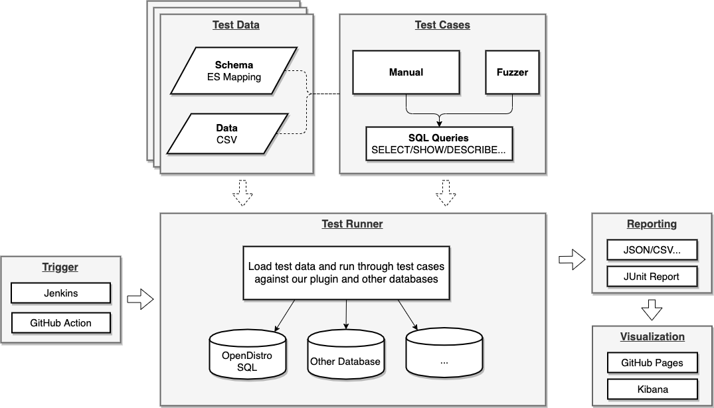
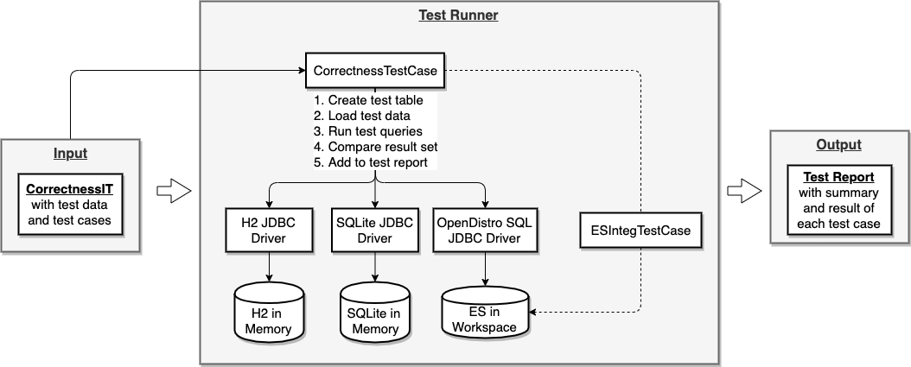
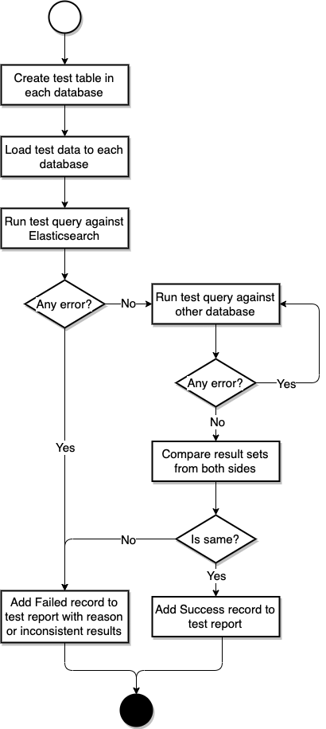

# How OpenDistro SQL Is Tested

## 1.Introduction

### 1.1 Problem Statement

Currently there are quite a few unit tests and integration tests in the codebase. However, there are still problems to rely on these test cases only to ensure the correctness of our plugin:

 1. **Test coverage**: Although the amount of test cases seems large, we’ve found that more than one important case was missed, for example use table alias in FROM clause, GROUP BY field alias etc.
 2. **Test correctness**: Some test case make assertion on the result set too simple to capture the issue if any. For example, some assertion is as loose as checking if result set is not empty. Unfortunately with strict assertion, we’re still not sure if the assertion is correct or not. For example, there were issue [#124](https://github.com/opendistro-for-elasticsearch/sql/issues/124) and [#226](https://github.com/opendistro-for-elasticsearch/sql/issues/226) regarding LEFT JOIN with WHERE clause and SUBSTRING. The correct semantic was actually different from what we thought. We did have MySQL reference docs at hands but it’s possible to miss some cases or misunderstand the correct use. So some mechanism is required to replace the loose assertion and be able to enforce the verification of our understanding.
 3. **Test Bench**: We want to run this new test on a regular basis to improving our implementation continuously.

### 1.2 Our Goals

In this work, we want to address the problems above for our testing to get more confidence of the correctness of our plugin. To achieve this goal, we need to improve both the quantity and quality of our tests and also keep it running on a regular basis. Although the search space of SQL is infinite, we can cover typical use cases and corner cases and most importantly make sure it does demonstrate the correctness of our implementation if it can pass.

> Note that performance is also another important area that we want to test and understand how efficient or where is the bottleneck of typical queries. Since Elasticsearch provides ESRally benchmark tool which is totally different from our homemade test harness, we will be focuses on the correctness and won't cover performance testing here.

## 2.Design

### 2.1 Approaches

First we can improve the test coverage by improving the diversity of our test case set, including diversity of test schema, test data and test cases. Secondly although it's difficult to provide rigorous mathematical proof for the result set of each query, we can make our best to ensure relative correctness by comparing with a few other database implementations. Of course the comparison testing doesn't guarantee 100% correctness and heavily depends on the correctness of reference implementation. But it should be much more reliable than hand written assertions after reading specification documentation previously.

### 2.2 Components

At this stage we don’t want to spend too much efforts on setting up a complicated infrastructure for testing. So we can take full advantage of capabilities that GitHub provides:

 1. **Test Data & Cases**: Use test case set with Kibana flights and ecommerce sample index.
 2. **Trigger**: Set up another GitHub Action workflow.
 3. **Test Runner**: Use embedded Elasticsearch and other IMDBs.
 4. **Reporting**: Use standard JUnit report or simple custom json format.
 5. **Visualization**: Enable GitHub Pages for viewing or feed into Elasticsearch.



## 3.Implementation

### 3.1 Test Data

For schema, we can just use Elasticsearch mapping as the format of schema and convert it to `INSERT` statement. For data we use CSV format simply.

```
{
  "_doc": {
    "properties": {
      "AvgTicketPrice": {
        "type": "float"
      },
      "Cancelled": {
        "type": "boolean"
      },
      "Carrier": {
        "type": "keyword"
      },
      ...
      ...
      "dayOfWeek": {
        "type": "integer"
      }
    }
  }
}

FlightNum,Origin,FlightDelay,DistanceMiles,...,DestCityName
9HY9SWR,Frankfurt am Main Airport,false,10247.856675613455,...,Sydney
X98CCZO,Cape Town International Airport,false,5482.606664853586,...,Venice
......
```

### 3.2 Test Cases

For now we don't implement a Fuzzer to generate test queries because test queries prepared manually is sufficient to help identify issues. So we just put all queries in a text file. In future, a fuzzer can generate queries and save to file to integrate with Test Runner smoothly.

```
SELECT 1 AS `empty` FROM `kibana_sample_data_flights`
SELECT substring(OriginWeather, 1, 2) AS OriginWeather FROM kibana_sample_data_flights
SELECT SUM(FlightDelayMin) AS sum_FlightDelayMin_ok FROM kibana_sample_data_flights
SELECT SUM(FlightDelay) AS sum_FlightDelay_ok FROM kibana_sample_data_flights
SELECT SUM(DistanceMiles) AS sum_DistanceMiles_ok FROM kibana_sample_data_flights
```

### 3.3 Test Runner

To simplify the test and be confident about the test result, Test Runner runs query by JDBC driver of OpenDistro SQL and other databases. In this case we don’t need to parse the data format returned from our plugin. And obviously another benefit is the correctness of JDBC driver is also covered.



### 3.4 Trigger

GitHub Action can be set up to trigger Gradle task to generate test report.

### 3.5 Reporting

Elasticsearch integration test is still using JUnit 4 which has many problems, such as dynamic test cases. So we can define our own report format for flexibility:

```
{
  "summary": {
    "total": 3,
    "success": 1,
    "failure": 2
  },
  "tests": [
    {
      "id": 1,
      "sql": "...",
      "result": "Success"
    },
    {
      "id": 2,
      "sql": "...",
      "result": "Failed",
      "resultSets": [
        {
          "database": "Elasticsearch",
          "resultSet": {
            "schema": [{"name":"","type":""},...],
            "dataRows": [[...],...,[...]]
          }
        },
        {
          "database": "Other database",
          "resultSet": {
            "schema": [...],
            "dataRows": [[...],...,[...]]
          }
        }
      ]
    },
    {
      "id": 3,
      "sql": "...",
      "result": "Failed",
      "reason": "..."
    },
  ]
}
```

The workflow of generating test result is:



 1. For the schema, name, type as well as their order requires to be the same.
 2. For the data rows, only data in each row matters with row order ignored.
 3. Report success if any other database result can match.
 4. Report error if all other databases throw exception.
 5. Report failure otherwise if mismatch and exception mixed.

### 3.6 Visualization

TODO

---

## Appendix

### I.Sample Usage

Use default test set and reference databases by `testType` argument given only. Because `integTestRunner` triggers quite a few integration tests which take long time and runs with `gradlew build` every time, `testType` is added to run doctest for documentation and comparison test separately.

Note that for now test data set argument is not supported because it often requires code changes to map more ES data type to JDBC type as well as convert data.

```
$ ./gradlew :integ-test:comparisonTest

    [2020-01-06T11:37:57,437][INFO ][c.a.o.s.c.CorrectnessIT  ] [performComparisonTest] Starting comparison test
    =================================
    Tested Database  : (Use internal Elasticsearch in workspace)
    Other Databases  :
     SQLite = jdbc:sqlite::memory:
     H2 = jdbc:h2:mem:test;DB_CLOSE_DELAY=-1
    Test data set(s) :
    Test data set :
     Table name: kibana_sample_data_flights
     Schema: {
      "mappings": {
        "properties": {
          "AvgTicketPrice": {
            "type": "float"
          },
          "Cancelled": {
            "type": "boolean"
          },
          "Carrier": {
            "type": "keyword"
          },
          ...
        }
      }
    }

     Data rows (first 5 in 21):
     [FlightNum, Origin, FlightDelay, DistanceMiles, FlightTimeMin, OriginWeather, dayOfWeek, AvgTicketPrice, Carrier, FlightDelayMin, OriginRegion, FlightDelayType, DestAirportID, Dest, FlightTimeHour, Cancelled, DistanceKilometers, OriginCityName, DestWeather, OriginCountry, DestCountry, DestRegion, OriginAirportID, DestCityName, timestamp]
     [RGXY9H5, Chubu Centrair International Airport, false, 1619.970725161303, 124.1471507959044, Heavy Fog, 0, 626.1297405910661, Kibana Airlines, 0, SE-BD, No Delay, CAN, Guangzhou Baiyun International Airport, 2.06911917993174, true, 2607.0901667139924, Tokoname, Clear, JP, CN, SE-BD, NGO, Guangzhou, 2019-12-23T11:19:32]
     [WOPNZEP, Munich Airport, true, 198.57903689856937, 34.9738738474057, Sunny, 0, 681.9911763989377, Kibana Airlines, 15, DE-BY, Carrier Delay, VE05, Venice Marco Polo Airport, 0.5828978974567617, false, 319.58198155849124, Munich, Cloudy, DE, IT, IT-34, MUC, Venice, 2019-12-23T12:32:26]
     [G9J5O2V, Frankfurt am Main Airport, false, 4857.154739888458, 651.402736475921, Clear, 0, 868.0507463122127, Kibana Airlines, 0, DE-HE, No Delay, XIY, Xi'an Xianyang International Airport, 10.856712274598683, false, 7816.832837711051, Frankfurt am Main, Thunder & Lightning, DE, CN, SE-BD, FRA, Xi'an, 2019-12-23T03:48:33]
     [HM80A5V, Itami Airport, false, 5862.6666599206, 555.0027890084269, Heavy Fog, 0, 765.0413127727119, Logstash Airways, 0, SE-BD, No Delay, TV01, Treviso-Sant'Angelo Airport, 9.250046483473783, true, 9435.047413143258, Osaka, Clear, JP, IT, IT-34, ITM, Treviso, 2019-12-23T19:50:48]

    Test data set :
     Table name: kibana_sample_data_ecommerce
     Schema: {
      "mappings": {
        "properties": {
          "category": {
            "type": "text",
            "fields": {
              "keyword": {
                "type": "keyword"
              }
            }
          },
          "currency": {
            "type": "keyword"
          },
          "customer_birth_date": {
            "type": "date"
          },
          ...
        }
      }
    }
     Data rows (first 5 in 21):
     [customer_first_name, customer_phone, type, manufacturer, customer_full_name, order_date, customer_last_name, day_of_week_i, total_quantity, currency, taxless_total_price, total_unique_products, category, customer_id, sku, order_id, user, customer_gender, email, day_of_week, taxful_total_price]
     [Irwin, , order, [Elitelligence, Microlutions], Irwin Mcdonald, 2019-12-19T23:21:07+00:00, Mcdonald, 3, 2, EUR, 26.98, 2, [Men's Clothing], 14, [ZO0564605646, ZO0117401174], 551689, irwin, MALE, irwin@mcdonald-family.zzz, Thursday, 26.98]
     [Wilhemina St., , order, [Spherecords Maternity, Oceanavigations], Wilhemina St. Washington, 2019-12-19T08:03:50+00:00, Washington, 3, 2, EUR, 72.98, 2, [Women's Clothing], 17, [ZO0705107051, ZO0270302703], 550817, wilhemina, FEMALE, wilhemina st.@washington-family.zzz, Thursday, 72.98]
     [Kamal, , order, [Elitelligence, Oceanavigations], Kamal Foster, 2019-12-19T08:47:02+00:00, Foster, 3, 2, EUR, 45.98, 2, [Men's Clothing], 39, [ZO0532905329, ZO0277802778], 550864, kamal, MALE, kamal@foster-family.zzz, Thursday, 45.98]
     [Diane, , order, [Tigress Enterprises, Low Tide Media], Diane Turner, 2019-12-22T13:45:07+00:00, Turner, 6, 2, EUR, 107.94, 2, [Women's Clothing, Women's Shoes], 22, [ZO0059900599, ZO0381103811], 555222, diane, FEMALE, diane@turner-family.zzz, Sunday, 107.94]

    Test query set   : SQL queries (first 5 in 215):
     SELECT SUBSTRING(`kibana_sample_data_flights`.`OriginWeather`, 1, 1024) AS `OriginWeather` FROM `kibana_sample_data_flights` GROUP BY 1
     SELECT SUM(`kibana_sample_data_flights`.`FlightDelayMin`) AS `sum_Offset_ok` FROM `kibana_sample_data_flights` GROUP BY 1
     SELECT SUM(`kibana_sample_data_flights`.`FlightDelay`) AS `sum_FlightDelay_ok` FROM `kibana_sample_data_flights` GROUP BY 1
     SELECT SUM(`kibana_sample_data_flights`.`DistanceMiles`) AS `sum_DistanceMiles_ok` FROM `kibana_sample_data_flights` GROUP BY 1
     SELECT YEAR(`kibana_sample_data_flights`.`timestamp`) AS `yr_timestamp_ok` FROM `kibana_sample_data_flights` GROUP BY 1

    =================================

    [2020-01-06T11:37:57,996][INFO ][c.a.o.s.c.CorrectnessIT  ] [performComparisonTest] Loading test data set...
    [2020-01-06T11:38:06,308][INFO ][c.a.o.s.c.CorrectnessIT  ] [performComparisonTest] Verifying test queries...
    [2020-01-06T11:38:21,180][INFO ][c.a.o.s.c.CorrectnessIT  ] [performComparisonTest] Saving test report to disk...
    [2020-01-06T11:38:21,202][INFO ][c.a.o.s.c.CorrectnessIT  ] [performComparisonTest] Report file location is /Users/xxx/Workspace/sql/reports/report_2020-01-06-19.json
    [2020-01-06T11:38:21,204][INFO ][c.a.o.s.c.CorrectnessIT  ] [performComparisonTest] Cleaning up test data...
    [2020-01-06T11:38:21,849][INFO ][c.a.o.s.c.CorrectnessIT  ] [performComparisonTest] Completed comparison test.
```

Specify different test case set by `queries` argument:

```
$ ./gradlew :integ-test:comparisonTest -Dqueries=sanity_integration_tests.txt

    ...
    Test query set   : SQL queries (first 5 in 7):
     SELECT AvgTicketPrice, Cancelled, Carrier, FlightDelayMin, timestamp FROM kibana_sample_data_flights
     SELECT AvgTicketPrice AS avg, Cancelled AS cancel, Carrier AS carrier, FlightDelayMin AS delay, timestamp AS ts FROM kibana_sample_data_flights
     SELECT Carrier, AVG(FlightDelayMin) FROM kibana_sample_data_flights GROUP BY Carrier
     SELECT Carrier, AVG(FlightDelayMin) FROM kibana_sample_data_flights GROUP BY Carrier HAVING AVG(FlightDelayMin) > 5
     SELECT YEAR(timestamp) FROM kibana_sample_data_flights
    ...
```

Specify external Elasticsearch cluster by `esHost` argument, otherwise an internal Elasticsearch in workspace is in use by default.

```
$ ./gradlew :integ-test:comparisonTest -DesHost=localhost:9200

    =================================
    Tested Database  : localhost:9200
    Other Databases  :
     SQLite = jdbc:sqlite::memory:
     H2 = jdbc:h2:mem:test;DB_CLOSE_DELAY=-1
    ...
```

Specify different databases for comparison. `dbUrl` is for database to be tested. `otherDbUrls` is for other databases whose result set be referenced and compared.

```
$ ./gradlew :integ-test:comparisonTest -Dqueries=sanity_integration_tests.txt -DdbUrl=jdbc:sqlite::memory:

    =================================
    Tested Database  : jdbc:sqlite::memory:
    Other Databases  :
     SQLite = jdbc:sqlite::memory:
     H2 = jdbc:h2:mem:test;DB_CLOSE_DELAY=-1
    ...

$ ./gradlew :integ-test:comparisonTest -Dqueries=sanity_integration_tests.txt -DdbUrl=jdbc:sqlite::memory: -DotherDbUrls=Unknown=jdbc:h2:mem:test;DB_CLOSE_DELAY=-1

    =================================
    Tested Database  : jdbc:sqlite::memory:
    Other Databases  :
     Unknown = jdbc:h2:mem:test
    ...
```
