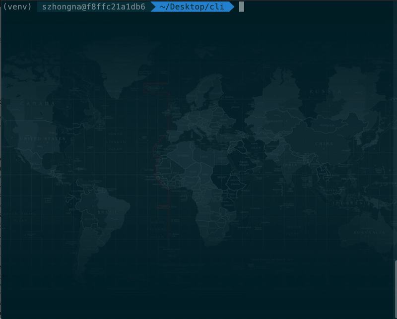

[](https://github.com/opendistro-for-elasticsearch/sql/actions)
[](https://pypi.python.org/pypi/odfe-sql-cli/)
[](https://opendistro.github.io/for-elasticsearch-docs/docs/sql/cli/)
[](https://discuss.opendistrocommunity.dev/c/sql/)


# Open Distro for Elasticsearch SQL CLI

The SQL CLI component in Open Distro for Elasticsearch (ODFE) is a stand-alone Python application and can be launched by a 'wake' word `odfesql`. 

It only supports [Open Distro for Elasticsearch (ODFE) SQL Plugin](https://opendistro.github.io/for-elasticsearch-docs/docs/sql/)
You must have the ODFE SQL plugin installed to your Elasticsearch instance to connect. 
Users can run this CLI from MacOS and Linux, and connect to any valid Elasticsearch end-point such as Amazon Elasticsearch Service (AES).




## Features

* Multi-line input
* Autocomplete for SQL syntax and index names
* Syntax highlighting
* Formatted output:
* Tabular format
* Field names with color
* Enabled horizontal display (by default) and vertical display when output is too wide for your terminal, for better visualization
* Pagination for large output
* Connect to Elasticsearch with/without security enabled on either **Elasticsearch OSS or Amazon Elasticsearch Service domains**.
* Supports loading configuration files
* Supports all SQL plugin queries

## Install

Launch your local Elasticsearch instance and make sure you have the Open Distro for Elasticsearch SQL plugin installed.

To install the SQL CLI:


1. We suggest you install and activate a python3 virtual environment to avoid changing your local environment:

    ```
    pip install virtualenv
    virtualenv venv
    cd venv
    source ./bin/activate
    ```


1. Install the CLI:

    ```
    pip3 install odfe-sql-cli
    ```

    The SQL CLI only works with Python 3, since Python 2 is no longer maintained since 01/01/2020. See https://pythonclock.org/


1. To launch the CLI, run:

    ```
    odfesql https://localhost:9200 --username admin --password admin
    ```
    By default, the `odfesql` command connects to [http://localhost:9200](http://localhost:9200/).


## Configure

When you first launch the SQL CLI, a configuration file is automatically created at `~/.config/odfesql-cli/config` (for MacOS and Linux), the configuration is auto-loaded thereafter.

You can also configure the following connection properties:


* `endpoint`: You do not need to specify an option, anything that follows the launch command `odfesql` is considered as the endpoint. If you do not provide an endpoint, by default, the SQL CLI connects to [http://localhost:9200](http://localhost:9200/).
* `-u/-w`: Supports username and password for HTTP basic authentication, such as:
    * Elasticsearch OSS with [Open Distro for Elasticsearch Security Plugin](https://opendistro.github.io/for-elasticsearch-docs/docs/install/plugins/) installed
    * Amazon Elasticsearch Service domain with [Fine Grained Access Control](https://docs.aws.amazon.com/elasticsearch-service/latest/developerguide/fgac.html) enabled
    * Elasticsearch with X-pack security enabled
* `--aws-auth`: Turns on AWS sigV4 authentication to connect to an Amazon Elasticsearch Service endpoint. Use with the AWS CLI (`aws configure`) to retrieve the local AWS configuration to authenticate and connect.

For a list of all available configurations, see [clirc](https://github.com/opendistro-for-elasticsearch/sql/blob/master/sql-cli/src/odfe_sql_cli/conf/clirc).


## Using the CLI

1. Save the sample [accounts test data](https://github.com/opendistro-for-elasticsearch/sql/blob/master/integ-test/src/test/resources/accounts.json) file.
2. Index the sample data.

    ```
    curl -H "Content-Type: application/x-ndjson" -POST https://localhost:9200/data/_bulk -u admin:admin --insecure --data-binary "@accounts.json"
    ```


1. Run a simple SQL command in ODFE SQL CLI:

    ```
    SELECT * FROM accounts;
    ```

    By default, you see a maximum output of 200 rows. To show more results, add a `LIMIT` clause with the desired value.

The CLI supports all types of query that ODFE SQL supports. Refer to [ODFE SQL basic usage documentation.](https://github.com/opendistro-for-elasticsearch/sql#basic-usage)


## Query options

Run single query from command line with options


* `--help`: help page for options
* `-q`: follow by a single query
* `-f`: support *jdbc/raw* format output
* `-v`: display data vertically
* `-e`: translate sql to DSL

## CLI Options

* `-l`: Query language option. Available options are [sql, ppl]. By default it's using sql.
* `-p`: always use pager to display output
* `--clirc`: provide path of config file to load

## Code of Conduct

This project has adopted an [Open Source Code of Conduct](https://opendistro.github.io/for-elasticsearch/codeofconduct.html).


## Security issue notifications

If you discover a potential security issue in this project we ask that you notify AWS/Amazon Security via our [vulnerability reporting page](http://aws.amazon.com/security/vulnerability-reporting/). Please do **not** create a public GitHub issue for security bugs you report.

## Licensing

See the [LICENSE](https://github.com/opendistro-for-elasticsearch/sql/blob/master/sql-cli/LICENSE.TXT) file for our project's licensing. We will ask you to confirm the licensing of your contribution.


## Copyright

Copyright 2020 Amazon.com, Inc. or its affiliates. All Rights Reserved.

