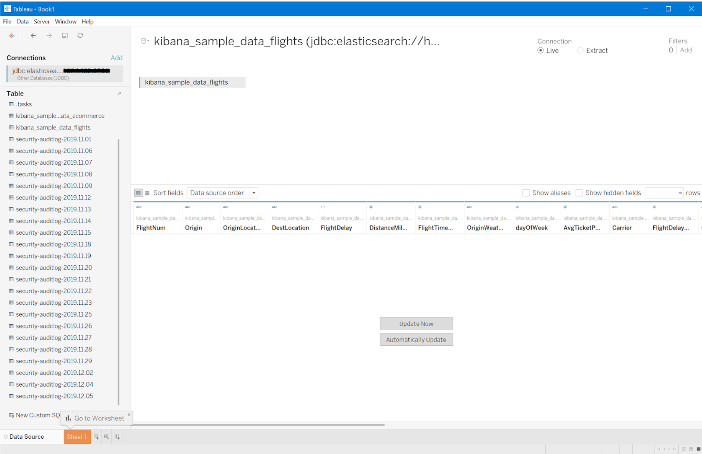
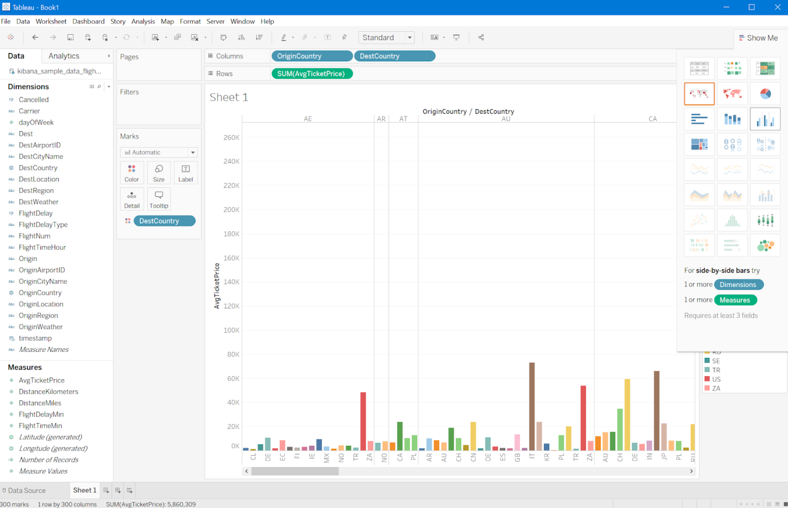

# Connecting Tableau with Open Distro for Elasticsearch

## Download and Installation

* Download and install [Tableau Desktop](https://www.tableau.com/en-ca/products/desktop/download).
* Install and configure [Open Distro for Elasticsearch](https://opendistro.github.io/for-elasticsearch-docs/docs/install/).
* Download the [Open Distro for ElasticSearch JDBC Driver](https://github.com/opendistro-for-elasticsearch/sql-jdbc#download-and-installation).

## Setup

### Specify the JDBC driver

Place the `opendistro-sql-jdbc-x.x.x.x.jar` file in the folder for your operating system. (Create the folder if it doesn't already exist.)

| Platform | Driver Path |
|---|---|
| Windows | C:\Program Files\Tableau\Drivers |
| Mac | ~/Library/Tableau/Drivers |
| Linux | /opt/tableau/tableau_driver/jdbc |

### Create TDC file

TDC file is required to add customization for the data connection. For reference, see the following sample `elasticsearch.tdc` file.
```
<?xml version='1.0' encoding='utf-16' ?>
<connection-customization class='genericjdbc' enabled='true' version='2019.3'>
  <vendor name='genericjdbc' />
  <driver name='elasticsearch' />
  <customizations>
	<customization name='CAP_CREATE_TEMP_TABLES' value='no'/>
	<customization name='CAP_SUPPRESS_DISCOVERY_QUERIES' value='yes' />
	<customization name='CAP_SUPPRESS_DISPLAY_LIMITATIONS' value='yes'/>
	<customization name='CAP_JDBC_SUPPRESS_ENUMERATE_DATABASES' value='yes' />
	<customization name='CAP_JDBC_SUPPRESS_ENUMERATE_SCHEMAS' value='yes' />
	<customization name='CAP_JDBC_SUPPRESS_EMPTY_CATALOG_NAME' value='yes' />
	<customization name='CAP_JDBC_METADATA_READ_PRIMARYKEYS' value='no'/>
	<customization name='CAP_QUERY_SUBQUERIES_WITH_TOP' value='yes'/>
  </customizations>
</connection-customization> 
```
* Using a text editor, add `<connection-customization>` section.
* Name the file `elasticsearch.tdc` and save it to `My Tableau Repository\Datasources`.
* Restart Tableau to apply the change.

For futher details check [using a .tdc file with Tableau](https://kb.tableau.com/articles/howto/using-a-tdc-file-with-tableau-server)

 ### Connection information

You will need:
* [JDBC connection string](https://github.com/opendistro-for-elasticsearch/sql-jdbc#connection-url-and-other-settings) to enter in the URL field when you connect.

  Sample connection string for connecting to localhost: `jdbc:elasticsearch://localhost:9200`.

* Credentials for signing in to the server (user name and password).
* (Optional) JDBC properties file to customize the driver behavior. For more details check [Customize JDBC Connections Using a Properties File](https://community.tableau.com/docs/DOC-17978)
  * Create a properties file called `elasticsearch.properties`.
  * Save the file to the `My Tableau Repository\Datasources` directory.


## Make the connection

1. Start Tableau and under **Connect**, select **Other Databases (JDBC)**. If not visible, select **More** under **To a Server** to find it in the list.
2. Enter the JDBC connection string in the **URL** field.
3. Select the **Dialect** as **MySQL** from the drop-down list.
4. Enter the user name and password for signing into the server.
5. (Optional) Browse to the JDBC properties file.
6. Select **Sign in**


### Prepare data

* Select a single table by double-clicking or dragging the required table to the canvas.
* To add data from two or more tables:
  1. Double click or drag tables to canvas.
  2. Select the desired type of join operation. Tableau supports inner join, right join, left join and full outer join. 
  3. Select columns for join. (For meaningful result, type of column should be the same.)



### Build charts and analyze data

1. Select **Sheet 1** on the bottom left corner. 
2. Double click or drag desired fields under **Measure**.
3. Double click or drag desired fields under **Dimensions**.
4. Select available visualization under **Show Me**.


