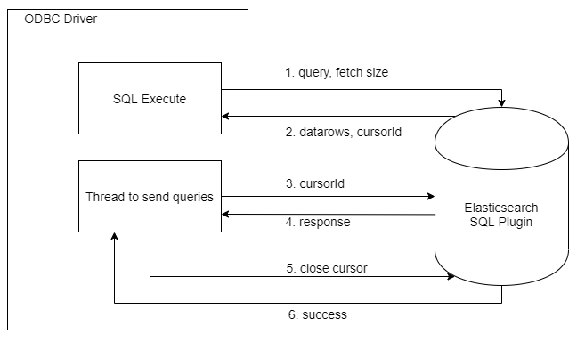

# Opendistro ODBC Driver Cursor (Pagination) Support Design Documentation

## Overview
Elasticsearch ODBC Driver supports forward-only cursor. This document illustrates how the cursor(pagination) is handled in the driver. 

For information on how the pagination is supported on Elasticsearch server, check [Opendistro SQL Cursor (Pagination) Support](https://github.com/opendistro-for-elasticsearch/sql/blob/master/docs/dev/Pagination.md).

## Data Flow

 

* Steps 3 & 4 will repeatedly get datarows until entire result is retrieved.
* Step 5 will send a request to close cursor whenever the connection is closed.
* ODBC Driver will provide an option to define fetch size as a connection parameter.
  * If fetch size is zero, query will fallback to non-cursor behavior.
  * If fetch size is not given then the number of rows per request will be as per server-defined [default fetch size](https://github.com/opendistro-for-elasticsearch/sql/blob/master/docs/dev/Pagination.md#42-salient-points).
* ODBC Driver will send the request to close cursor whenever the connection is closed.

## Detailed Design

The ODBC Driver will use std::promise and std::future to retrieve the result asynchronusly.

* Thread to send queries is designed to get the next set of results.
* Thread to process data is designed to parse the datarows and add the results in the resultset.

