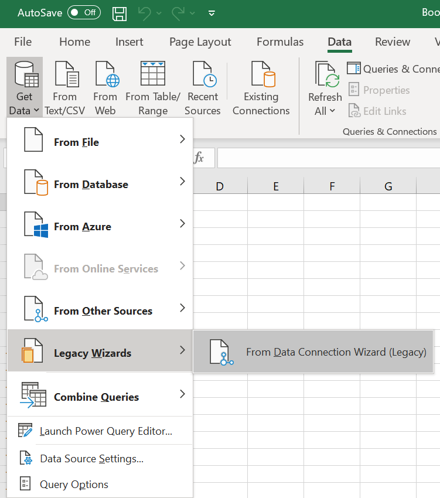
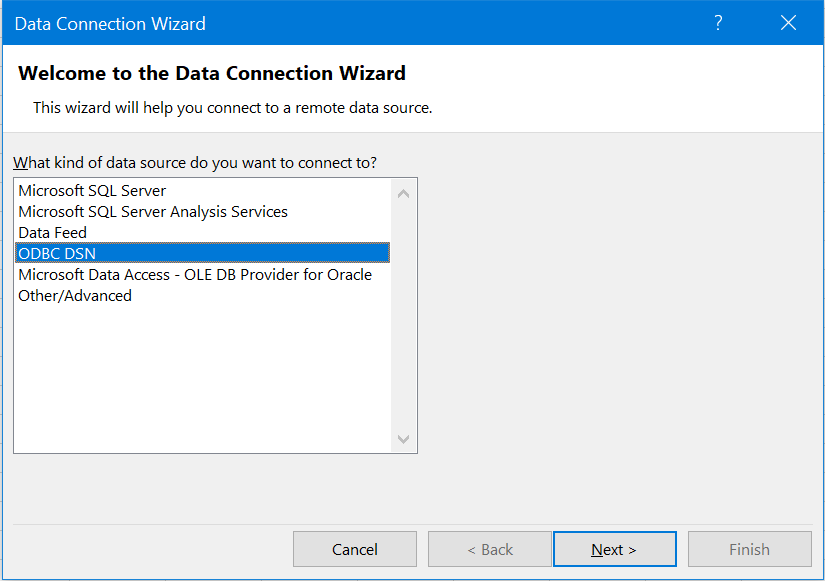
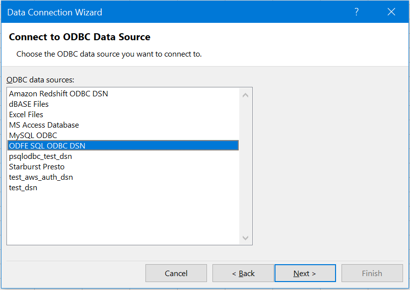
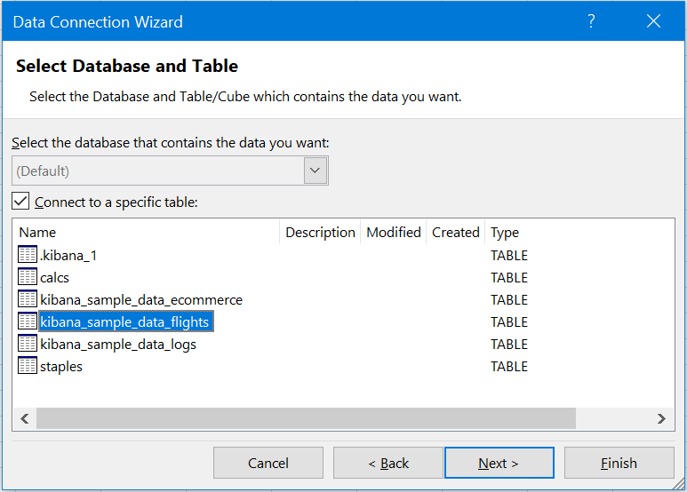
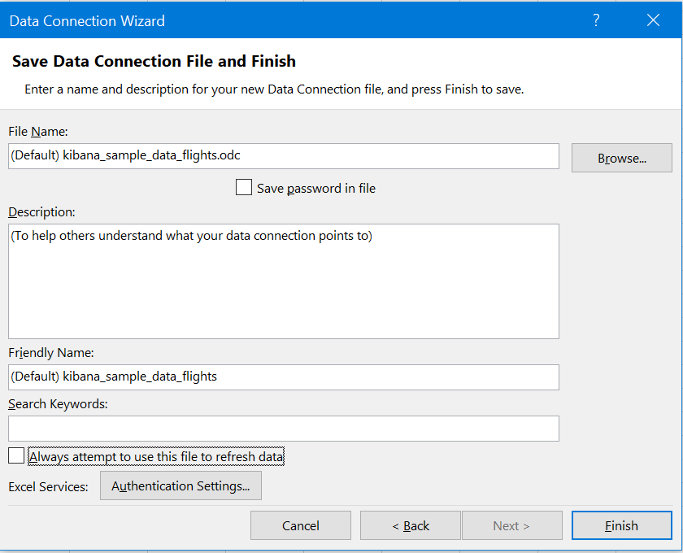
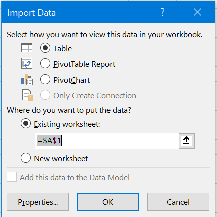
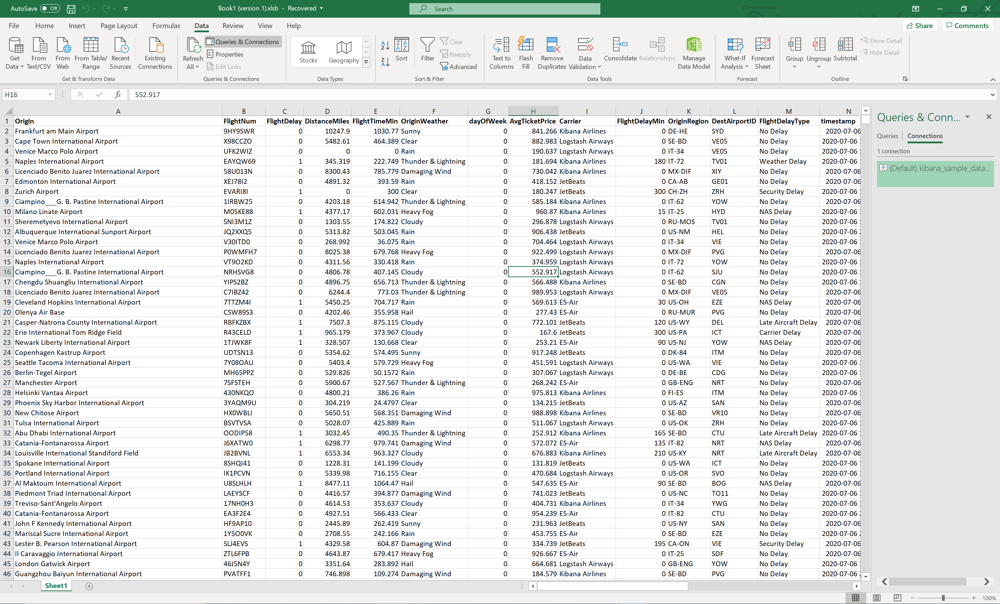
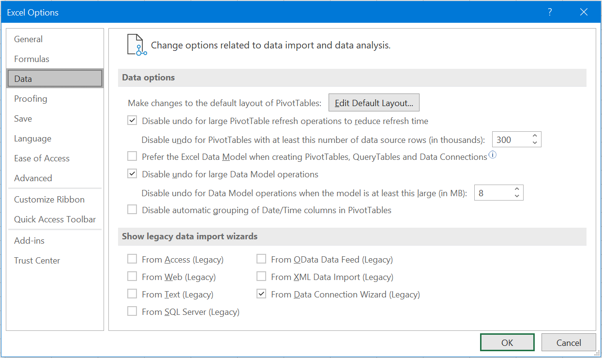

## Data Connection Wizard 

* Open blank workbook in Microsoft Excel.
* Click on **Data** > **Get Data** > **Legacy Wizards** > **From Data Connection Wizard (Legacy)**

* Select **ODBC DSN** and Click on **Next**.

* Select **ODFE SQL ODBC DSN** and Click on **Next**.

* Select required table and Click on **Next**.

* Add the description. Edit file names if required. Select whether to use this connection file while refreshing data. Click on **Finish**.

* Select the worksheet to load data. Click on **OK**.

* Data will be loaded in the spreadsheet.

**NOTE**: If **Legacy Wizards** is disabled in Microsoft Excel, It can enabled by **File** > **Options** > **Data** > **Show legacy data import wizards** > Check **From Data Connection Wizard (Legacy)**.

