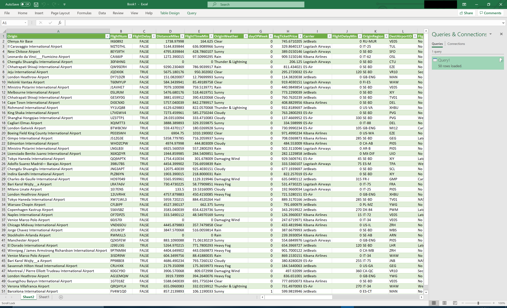
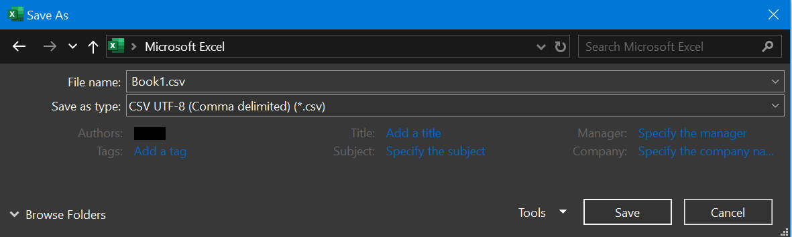
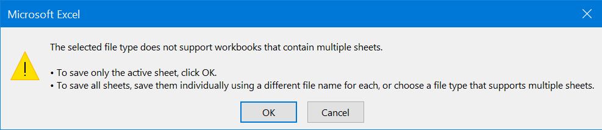

## Exporting CSV files in Microsoft Excel

* Load data from Open Distro For Elasticsearch by any using any [connection mode](excel_connection.md).

For this example, [ODBC](odbc_data_source_connection.md) connection with SQL statement `SELECT * FROM kibana_sample_data_flights LIMIT 50` in advanced options is used.

* Click on **File** > **Save As**.
* Select Location to Save file.
* Type the file name into the **File name** field.
* Set **Save as type** as **CSV UTF-8(Comma delimited)(*.csv)**.

* Click **Save**.
* If you have multiple sheets in the workbook, you will get following message

* Click on **OK**.
* Data should be exported to selected location in CSV format.
