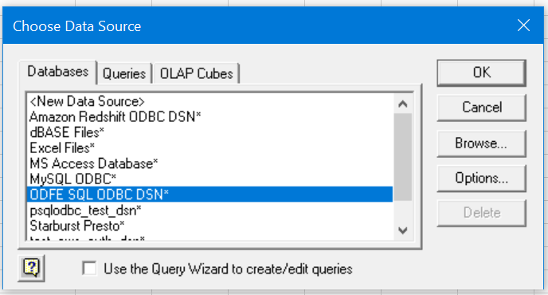
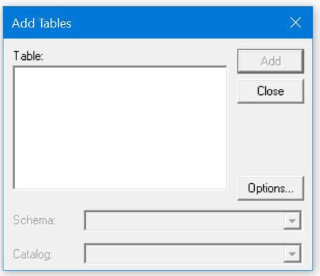
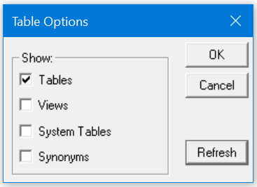
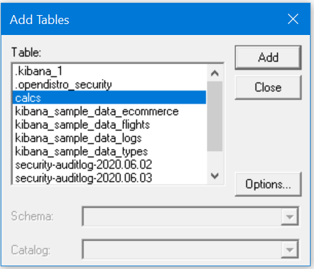
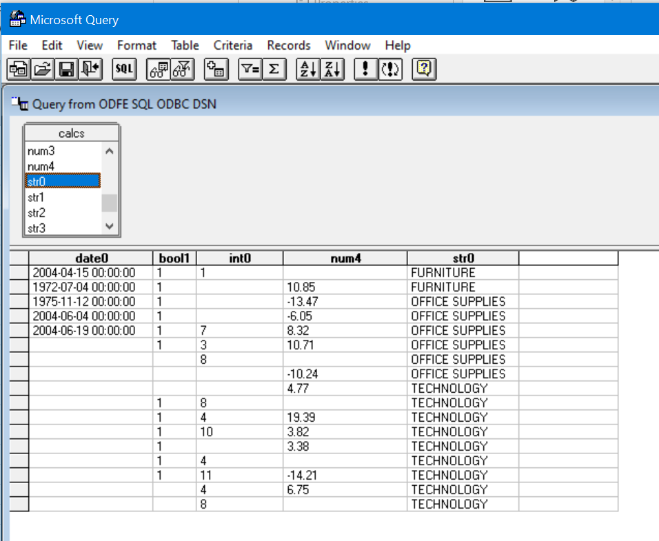
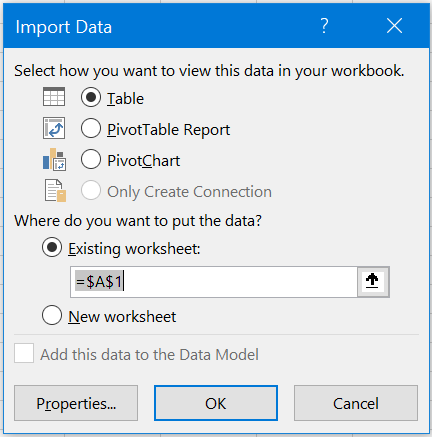
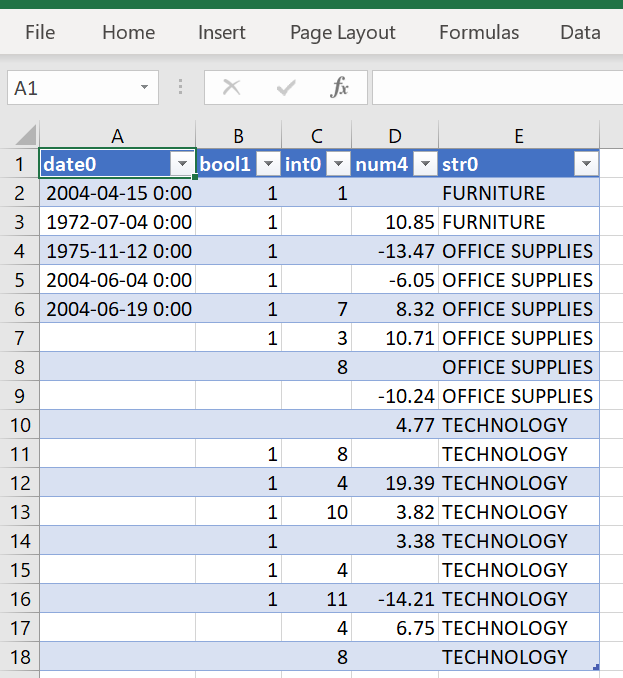

## Microsoft Query Connection

* Open blank workbook in Microsoft Excel.
* Click on **Data** > **Get Data** > **From Other Sources** > **From Microsoft Query**

* Select **Databases** > **ODFE SQL ODBC DSN**. 
* Clear the **Use the Query Wizard to create/edit queries** check box, and then click on **OK**.

* Click on **Options** in Add Table window.

* Click **Refresh**. Select checkbox **Tables**. Clear all other checkboxes. Click on **OK**.

* Select tables and click on **Add**. After all required tables are added, click on **Close**.

* Double click on required columns. You can double-click the asterisk (*) to select all the columns from a table.

* You can select different options to define query here. Ensure the query is supported by the [OpenDistro for Elasticsearch SQL plugin](https://github.com/opendistro-for-elasticsearch/sql). After defining query, click on **Return Data** to retrieve the result set.
* Select worksheet and click on **OK**.

* Data will be loaded in the spreadsheet

