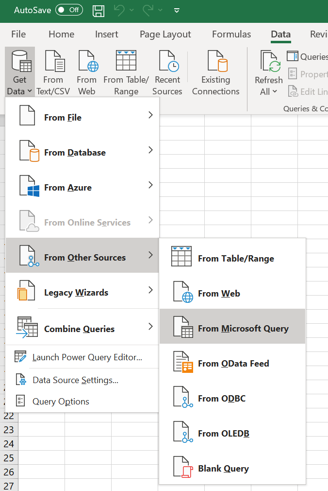
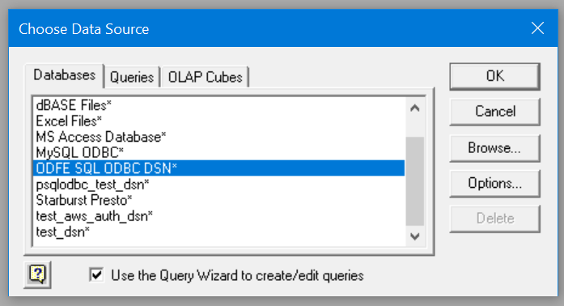
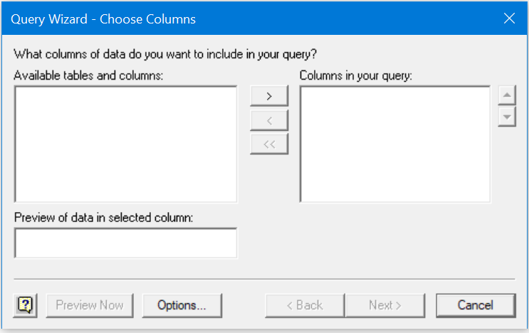
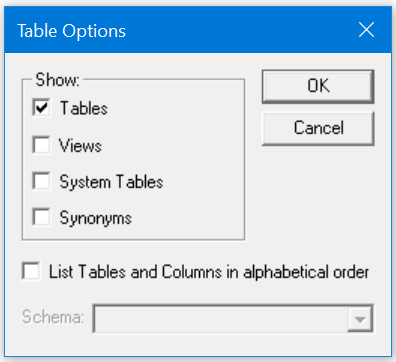
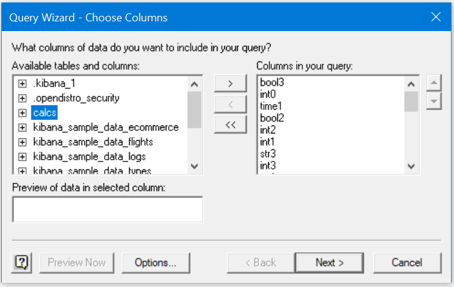
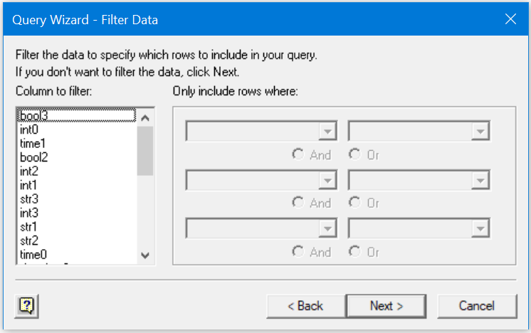
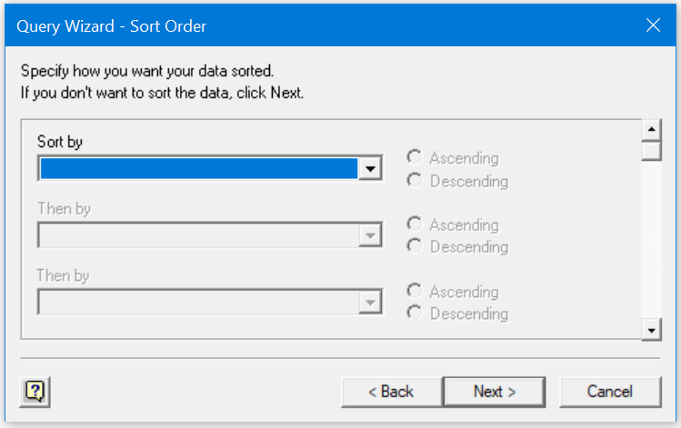
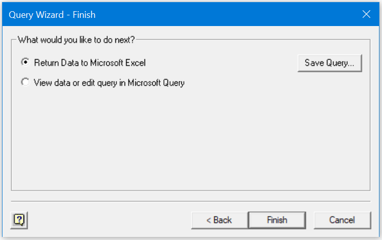
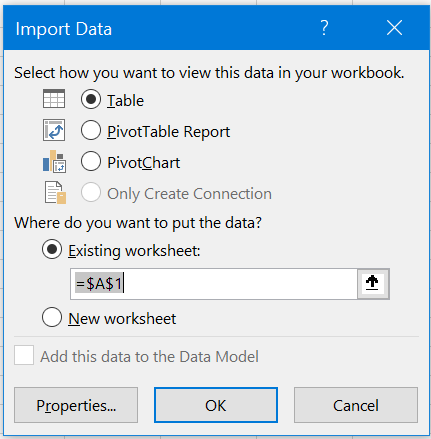

## Query Wizard Connection

* Open blank workbook in Microsoft Excel.
* Click on **Data** > **Get Data** > **From Other Sources** > **From Microsoft Query**

* Select **Databases** > **ODFE SQL ODBC DSN**. 
* Ensure the **Use the Query Wizard to create/edit queries** check box is selected, and then click **OK**.

* You might get an popup with a message `This data source contains no visible tables`. Click on **OK**.

* Click on **Options** in Query Wizard window.

* Select checkbox **Tables**. Clear all other checkboxes. Click on **OK**.

* You will see list of available tables & columns. Select required tables/columns and click on **>**. 
* After selecting all required columns, Click on **Next**.

* Specify conditions to apply filter if needed. Ensure selected operations are supported by Elasticsearch. Click on **Next**.

* Specify sorting options if required. Ensure selected operations are supported by the [OpenDistro for Elasticsearch SQL plugin](https://github.com/opendistro-for-elasticsearch/sql). Click on **Next**.

* Select **Return Data to Microsoft Excel** and click on **Finish**.

*  Select worksheet and click on **OK**.

* Data will be loaded in the spreadsheet

