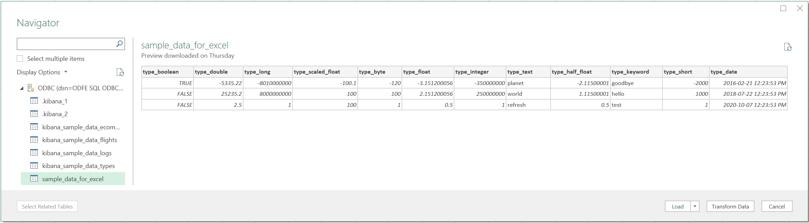
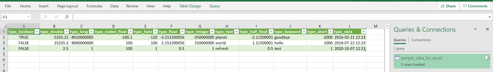
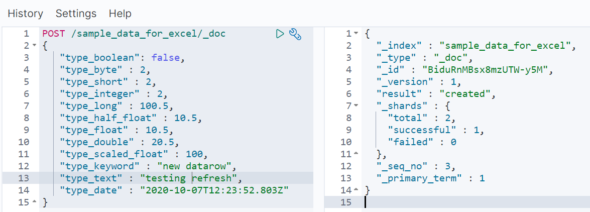
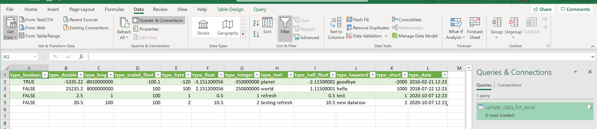

## Refresh the loaded data 

* Load data from Open Distro For Elasticsearch by any using any [connection mode](excel_connection.md).

For this example, [ODBC](odbc_data_source_connection.md) connection is used with the table `sample_data_for_excel` which has 3 datarows as shown in picture.

* Add a datarow in the table `sample_data_for_excel` using kibana.

* Click on **Data** > **Refresh All** > **Refresh**.

* Verify the data is updated.