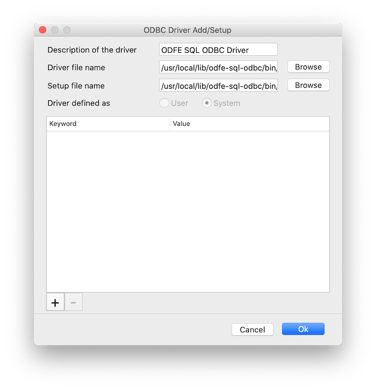
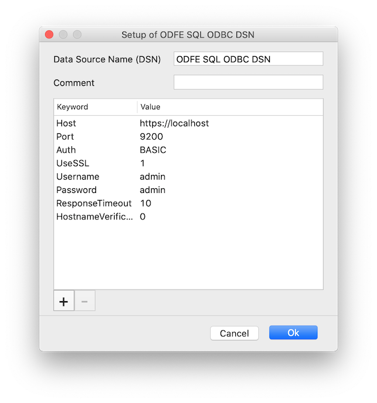

# Configuring a DSN on Mac

> NOTE: iODBC Administrator is included with the [iODBC Driver Manager](http://www.iodbc.org/dataspace/doc/iodbc/wiki/iodbcWiki/Downloads), which must be installed in order to use the driver on Mac.

1. Open **iODBC Administrator** using the following command (this gives the application permissions to save the Driver & DSN configurations):
	1. `sudo /Applications/iODBC/iODBC\ Administrator64.app/Contents/MacOS/iODBC\ Administrator64`

## Adding a Driver Entry

Note: In order to use the Open Distro for Elasticsearch SQL ODBC driver with the [Tableau Connector](), the **Description of the Driver** field *must* start with `ODFE SQL ODBC`. 

1. Go to the **ODBC Drivers** tab.
2. Click **Add a Driver**.
	* **Description of the Driver**: The driver name used for ODBC connections (ex. `ODFE SQL ODBC Driver`)
	* **Driver File Name**: The path to the driver file (default installed path: `/usr/local/lib/odfesqlodbc/bin/libodfesqlodbc.dylib`)
	* **Setup File Name**: The path to the driver file (default installed path: `/usr/local/lib/odfesqlodbc/bin/libodfesqlodbc.dylib`)
	* Set as a **User** driver
    * Below is a screenshot of how the final screen should look.
3. Click **OK** to save the options.

 

## Adding a DSN Entry

This is not required if you are using the Tableau Connector, but will help with connecting to your data source through other applications.

1. Go to the **User DSN** tab
2. Select **Add** on the right side of the window.
	* Choose the Driver you added above.
	* **Data Source Name (DSN)**: The name of the DSN used to store connection options (ex. `ODFE SQL ODBC DSN`)
	* **Comment**: Not required
	* Add key-value pairs by using the **'+'** button. Below is a picture of the recommended set of options for a default local Open Distro for Elasticsearch installation.
3. Click **OK** to save the DSN configuration.

 

