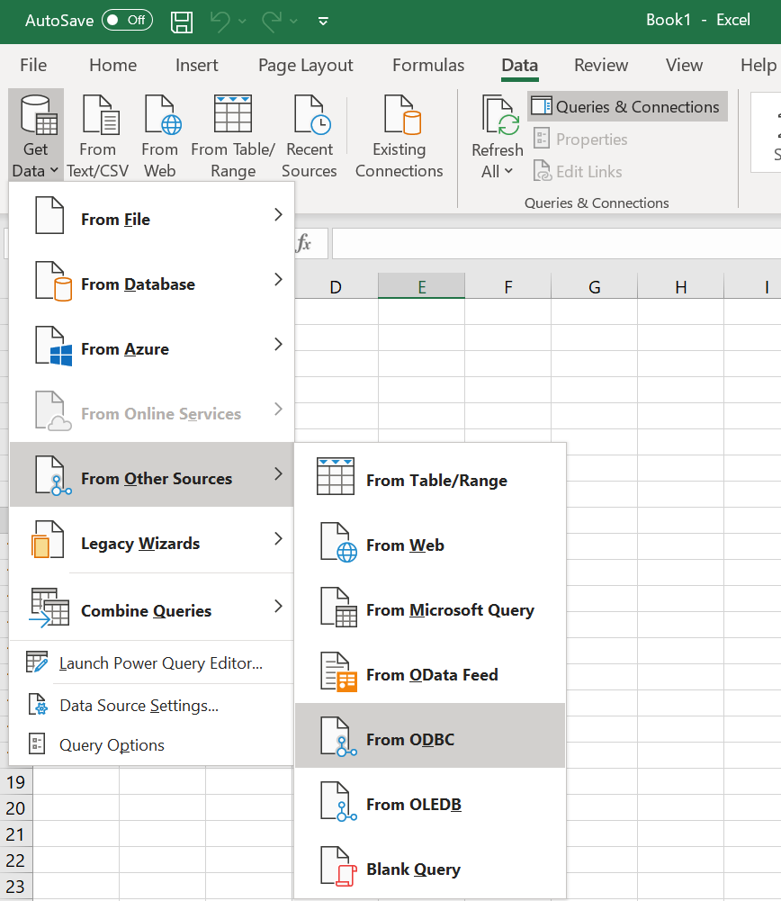
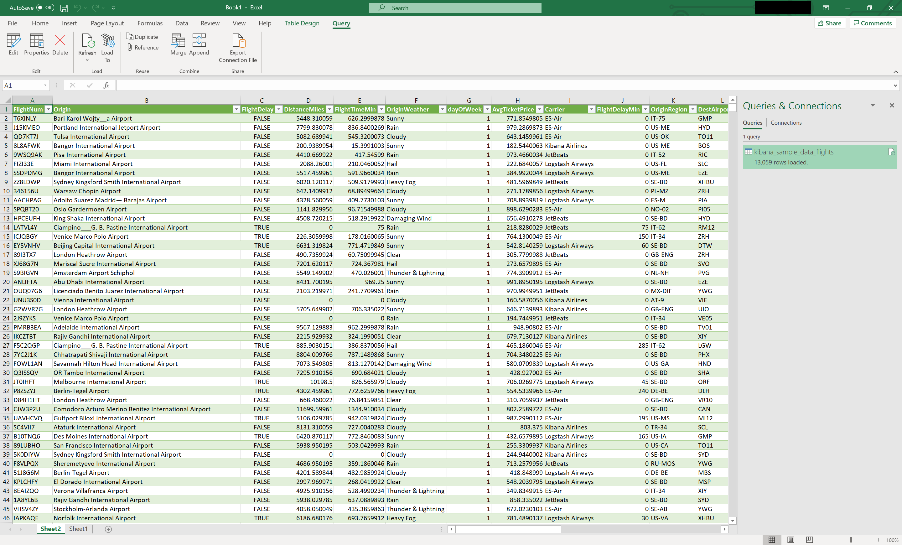

# Microsoft Excel

## Prerequisites

* Microsoft Excel 2016 and higher
* [Open Distro for Elasticsearch](https://opendistro.github.io/for-elasticsearch-docs/docs/install/)
* [Open Distro for Elasticsearch SQL ODBC driver](https://opendistro.github.io/for-elasticsearch-docs/docs/sql/odbc/)
* A preconfigured [User or System DSN](../../README.md)

## Load data 

* Open blank workbook in Microsoft Excel.
* Click on **Data** > **Get Data** > **From Other Sources** > **From ODBC**

* Select **ODFE SQL ODBC DSN**. Click **OK**.

* Select **Default or Custom** in connection credentials windows and click on **Connect**.

* Select a table from list to load data preview. Click on **Load**.

* Data will be loaded in the spreadsheet.

**NOTE**: There are multiple ways to load data in Microsoft Excel. Alternate options are **Data** > **Get Data** > **From Other Sources** > **From Microsoft Query** and **Data** > **Get Data** > **Legacy Wizards** > **From Data Connection Wizard**.

## Refresh Data

To refresh the data click on **Query** > **Refresh**.

Alternately, **Data** > **Refresh** option can also be used to refresh the data.

## Export as CSV files

* Click on **File** > **Save As**.
* Select Location to Save file.
* Type the file name.
* Set type as **CSV UTF-8(Comma delimited)(*.csv)**.

* Click **Save**.
* Data will be exported to selected location in CSV format.

## Troubleshooting

* If the table has large number of datarows, increase [the keepalive](https://github.com/opendistro-for-elasticsearch/sql/blob/master/docs/dev/Pagination.md#opendistrosqlcursorkeep_alive) value accordlingly. 

* If the table has nested or object type column, you might get an error as below.

If you ignore the error and try to load the data, column name and values might not match.

In this case, please use advanced options while connecting to the data source.

Also, make sure query doesn't include the name of nested or object type column name. For example, `SELECT products FROM kibana_sample_data_ecommerce` where product is nested type column might have data loss.

This issue will be resolved when [Object field is missing in SELECT result](https://github.com/opendistro-for-elasticsearch/sql/issues/564) is fixed.

