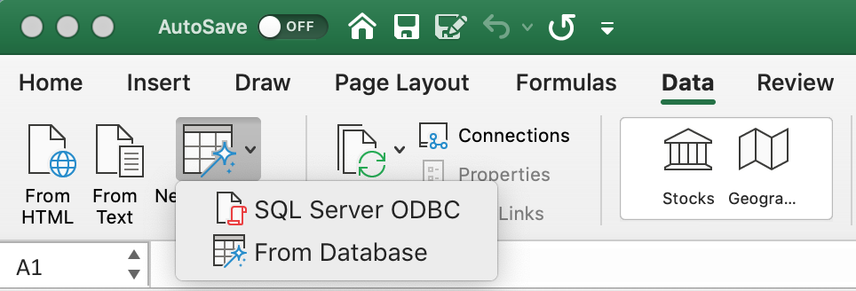
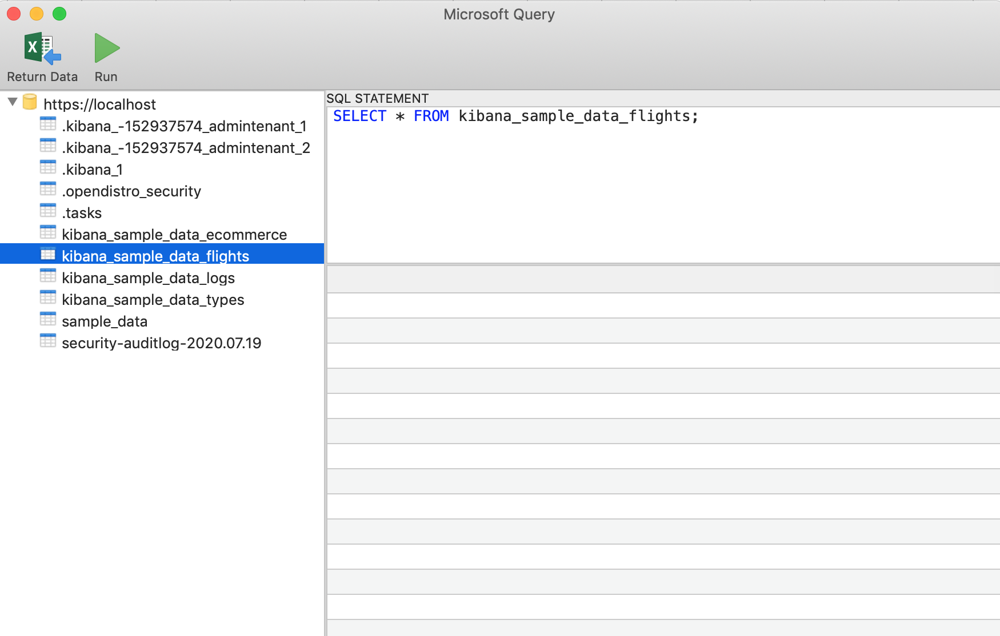
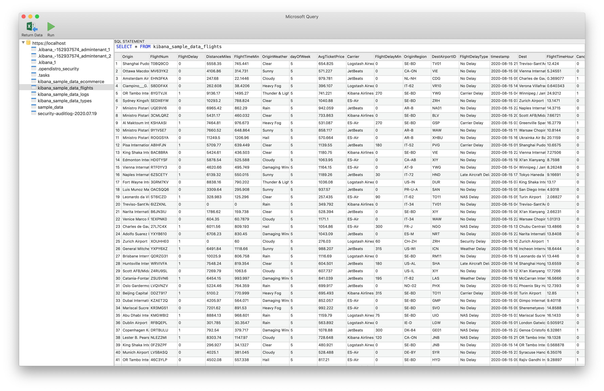

# Micosoft Excel on Mac OS

## Prerequisites

* Microsoft Excel 2016 and higher
* [Open Distro for Elasticsearch](https://opendistro.github.io/for-elasticsearch-docs/docs/install/)
* [Open Distro for Elasticsearch SQL ODBC driver](https://opendistro.github.io/for-elasticsearch-docs/docs/sql/odbc/)
* A preconfigured [User or System DSN](mac_configure_dsn.md)

## Test Successful Connection

* Open **iODBC Data Source Administrator** using command 

`sudo /Applications/iODBC/iODBC\ Administrator64.app/Contents/MacOS/iODBC\ Administrator64`

* Click on **System DSN**.
* Select **ODFE SQL ODBC DSN**.
* Click on **Configure**.

* Modify connection attributes accordingly.
* Click on **Ok**.
* Click on **Test**.
* Enter credentials if required and Click **Ok**.

* You should get a message as `The connection DSN was tested successfully, and can be used at this time.`

## Load data 

* Open blank workbook in Microsoft Excel.
* Click on **Data** > **New Database Query** > **From Database**.

* Select **ODFE SQL ODBC DSN**. Click **OK**.

* Enter credentials if required and click on **OK**.

* Select a table from the list. 

* Edit SQL statement if required and click on **Run**. Data preview will be loaded.

* Click on **Return Data**. Select sheet and click OK.

* Data will be loaded in the spreadsheet.

## Refresh Data

To refresh the data click on **Table** > **Refresh**.

Alternately, **Data** > **Refresh** option can also be used to refresh the data.

## Export as CSV files

* Click on **File** > **Save As**.
* Type the file name.
* Select Location to Save file.
* Set File Format to **CSV UTF-8(Comma delimited)(*.csv)**.

* Click **Save**.
* Data will be exported to selected location in CSV format.

## Troubleshooting

* If the table has large number of datarows, increase [the keepalive](https://github.com/opendistro-for-elasticsearch/sql/blob/master/docs/dev/Pagination.md#opendistrosqlcursorkeep_alive) value accordlingly. 

* You might need to remove `;` from SQL statement to load data preview.

