#  Connecting Open Distro For ElasticSearch to Microsoft Power BI Service

## Setup
* Download and Install [On-premises data gateway](https://docs.microsoft.com/en-us/data-integration/gateway/service-gateway-install)
* Change the path for custom data connector folder in On-premises data gateway so that the gateway can find the custom connector.
> NOTE: Ensure the gateway service account (**PBIEgwService**) has permissions to access the custom connector folder. Alternatively, you can copy connector file to `C:\Windows\ServiceProfiles\PBIEgwService\Documents\Power BI Desktop\Custom Connectors\`.

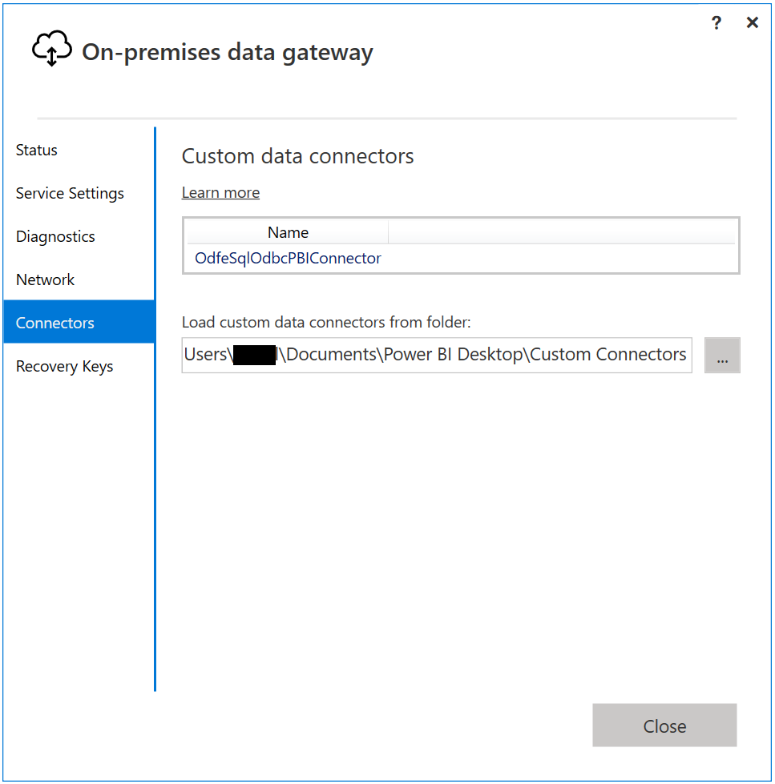

* Verify the status of data gateway is ready to be used.

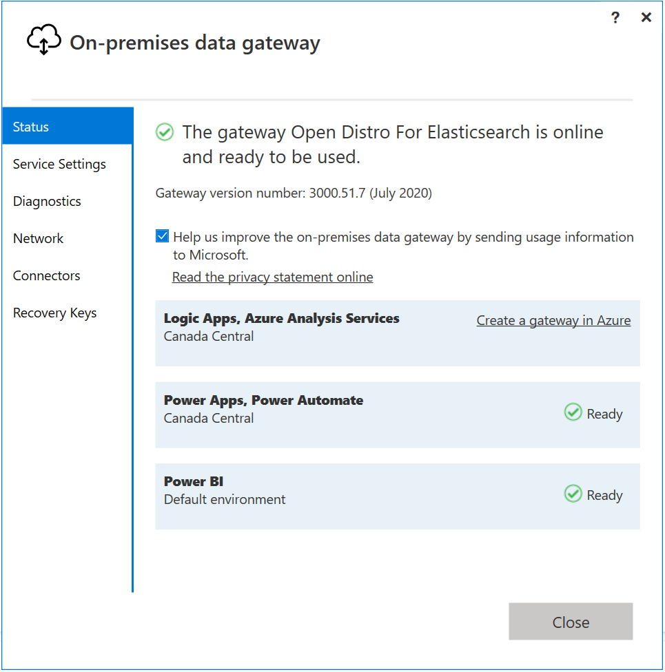

* Login to Power BI Service.
* Click on **Setting** > **Manage Gateway**.

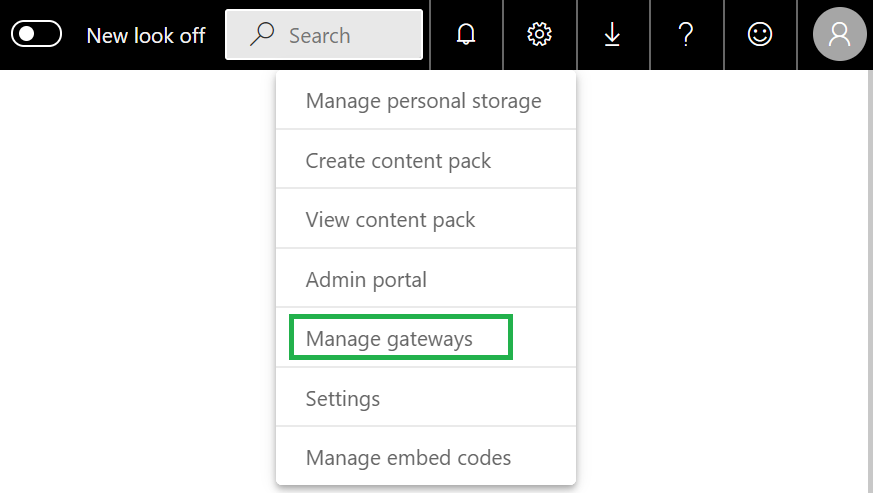

* Select **Allow user's custom data connectors to refresh through this gateway cluster(preview)**. Click on **Apply**.

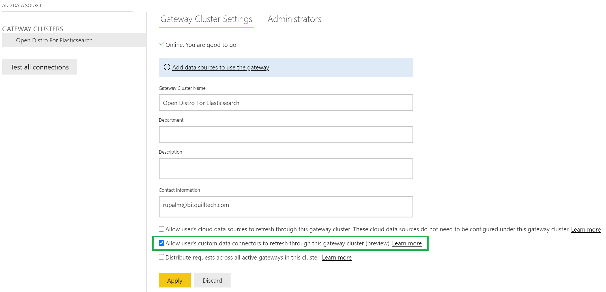

* Click on **Add data sources to use the gateway**.
* Select Data Source Type as **Open Distro For Elasticsearch**.
* Enter Data Source Name and Server values.
* Select required **Authentication Method**. Select **Anonymous** for auth **NONE**.
For **AWS_SIGV4**, select **Key** and set aws access credentials for user **PBIEgwService** at path `C:\Windows\ServiceProfiles\PBIEgwService\.aws\`

* Select Encryption mode for connection.
* Click on **Add**.

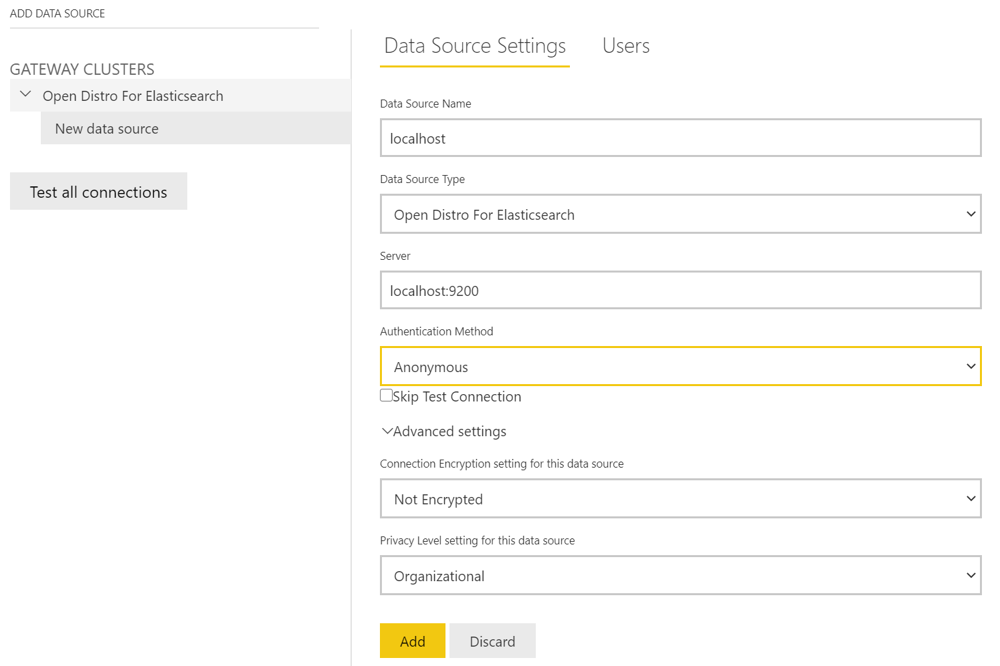

* You will get a **Connection Successful** message.

## Publish Report

* Follow [instructions](./power_bi_support.md) to create graph using Open Disto For Elasticsearch Data connector.
* Click on **Publish** to publish the report on Power BI service.

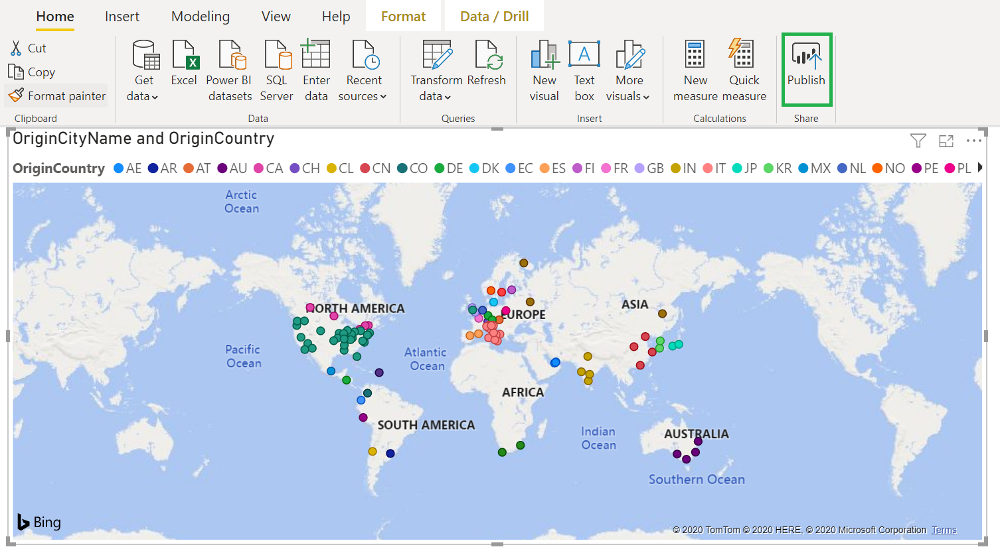

* Select destination and click on **Select**.

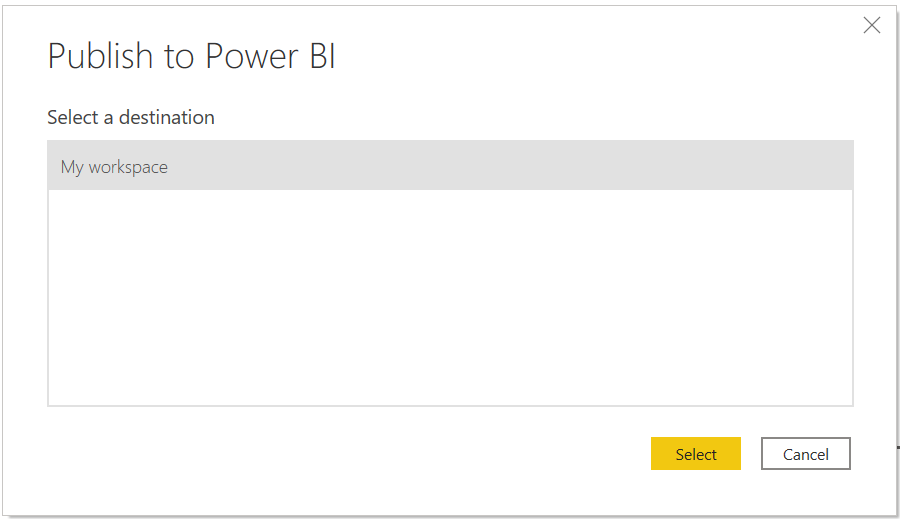

* You will get a success message when report is published.

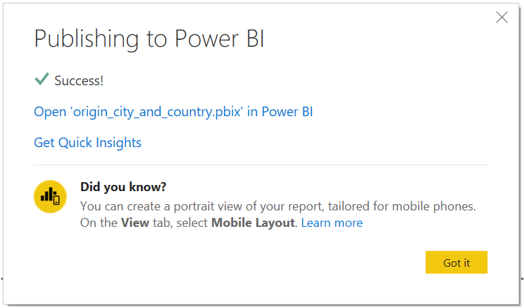

* Click on **Open '%report name%' in Power BI** to open published report in Power BI service.

## Modify report using Power BI Service

* Click on **Edit report** to modfify report.

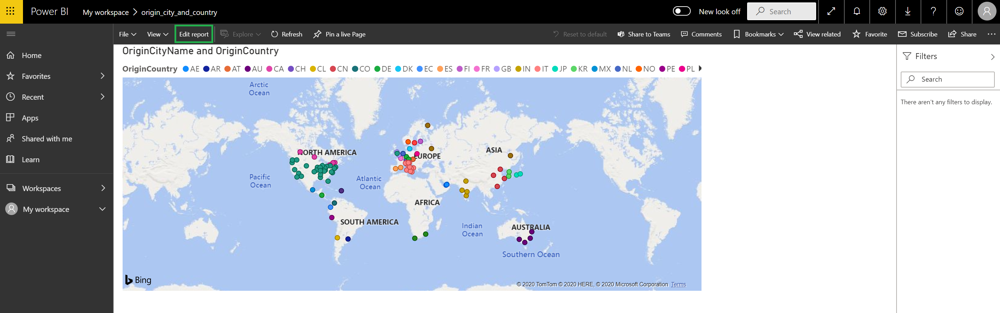

* Use **Filters**,**Visualizations** and **Fields** to modify report.

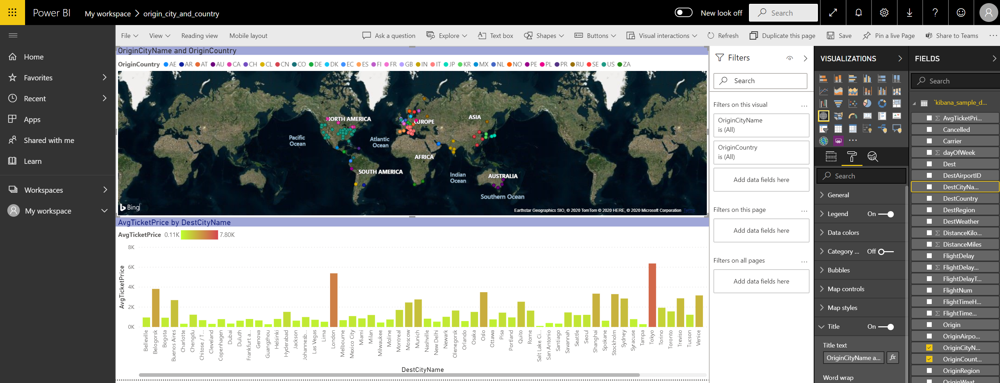

## Dataset Scheduled Refresh

* Click on **Settings** > **Datasets**.
* Select required Gateway and click on **Apply**.

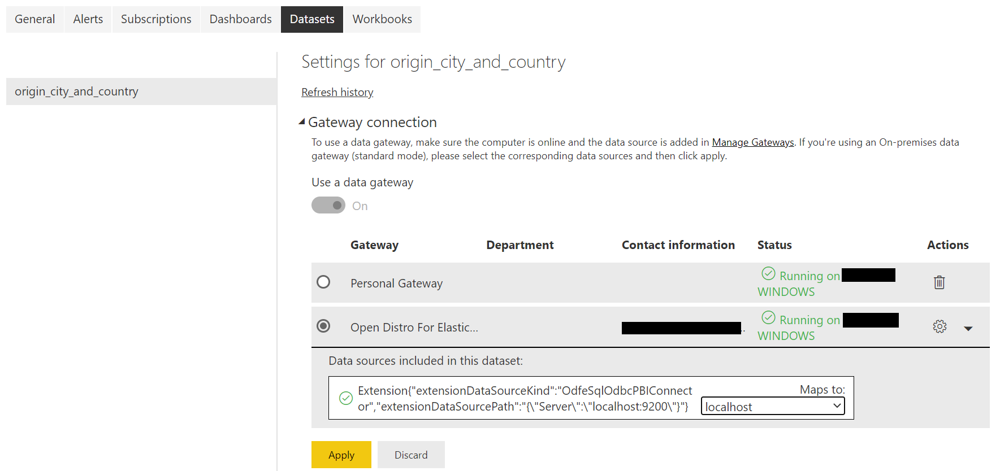

* Turn on Keep your data up to date option.
* Select refresh frequency and timezone.
* Add email for failure notifications if required.
* Click on **Apply**.

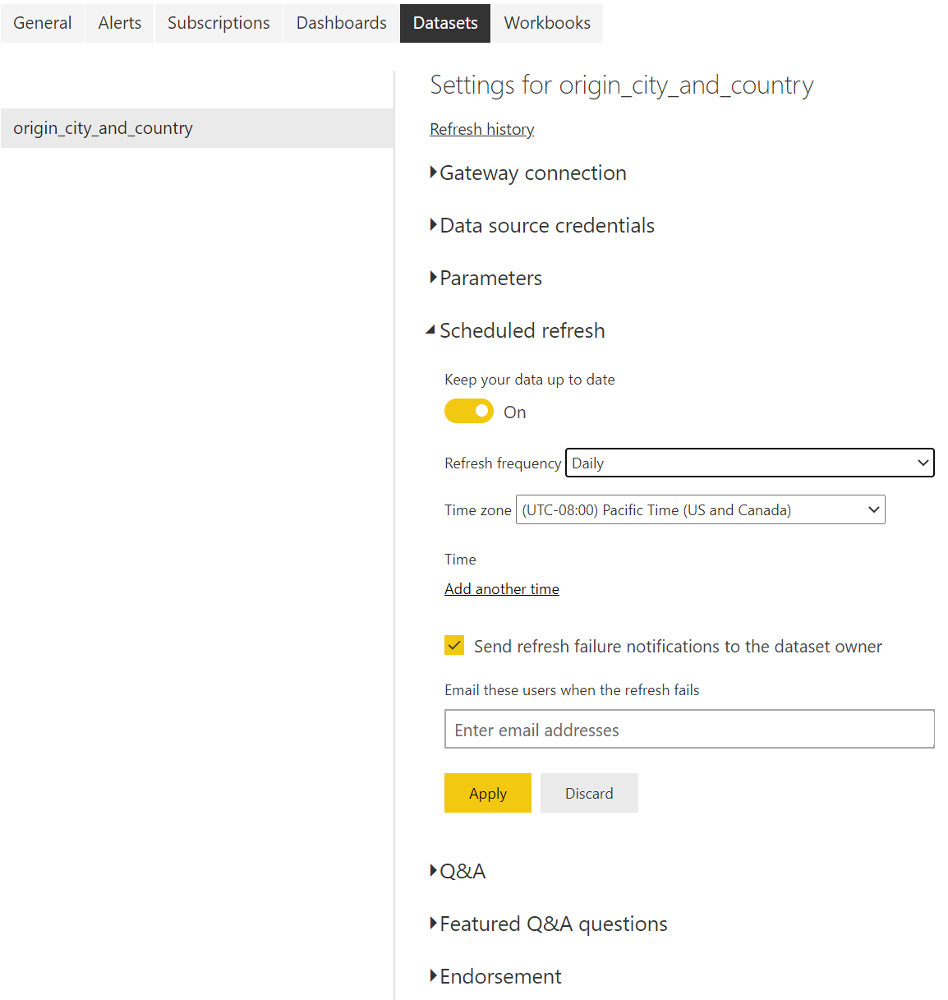

* You can also check history by clicking on **Refresh history**.

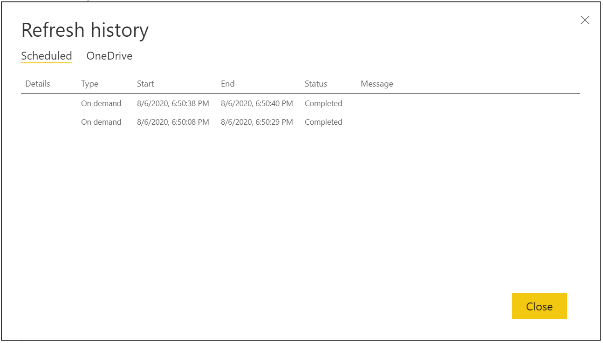