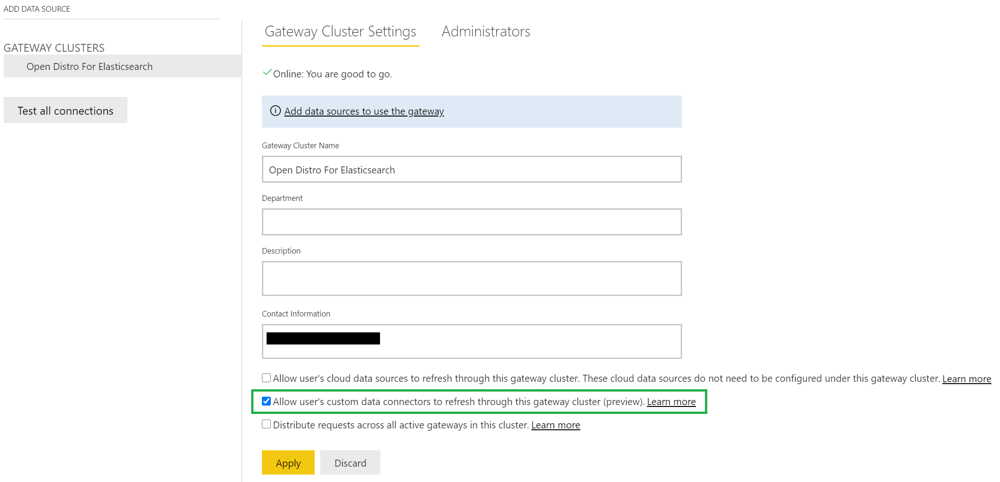

#  Connecting Open Distro For ElasticSearch to Microsoft Power BI Service

## Setup
* Download and Install [On-premises data gateway](https://docs.microsoft.com/en-us/data-integration/gateway/service-gateway-install)
* Change the path for custom data connector folder in On-premises data gateway so that the gateway can find the custom connector.
> NOTE: Ensure the gateway service account has permissions to access the custom connector folder. 

* Verify the status of data gateway is ready to be used.

* Login to Power BI Service.
* Click on **Setting** > **Manage Gateway**.

* Select **Allow user's custom data connectors to refresh through this gateway cluster(preview)**. Click on **Apply**.

* Add data source to use the gateway.

## Publish Report

* Follow [instructions](./power_bi_support.md) to create graph using Open Disto For Elasticsearch Data connector.
* Click on **Publish** to publish the report on Power BI service.

* Select destination and click on **Select**.

* You will get a success message when report is published.

* Click on **Open '%report name%' in Power BI** to open published report in Power BI service.

## Modify report using Power BI Service

* Click on **Edit report** to modfify report.

* Use **Filters**,**Visualizations** and **Fields** to modify report.

