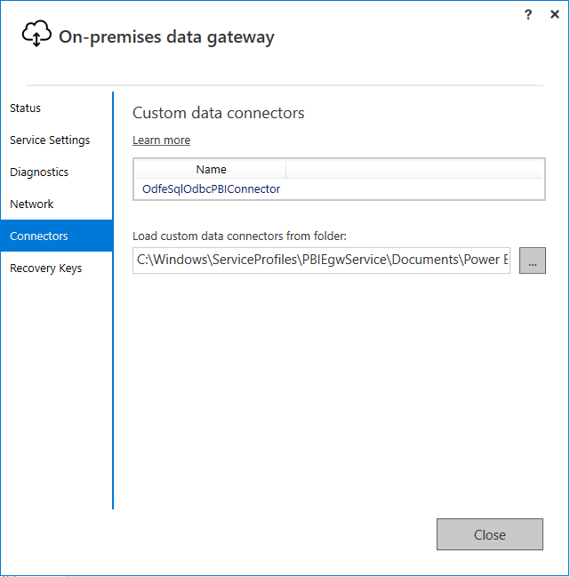
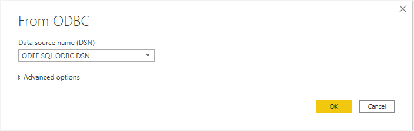
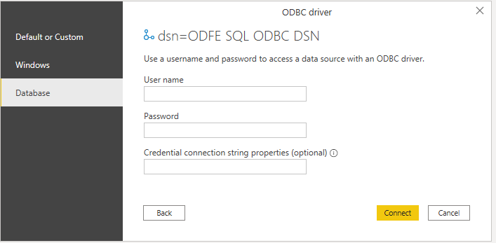
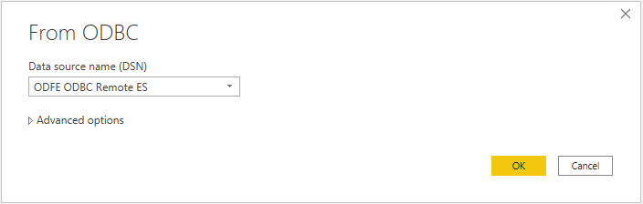
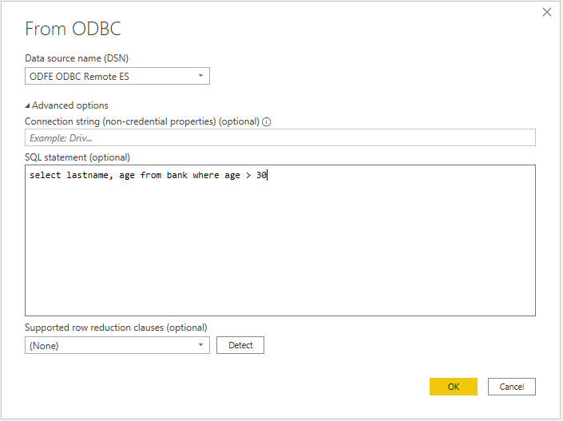
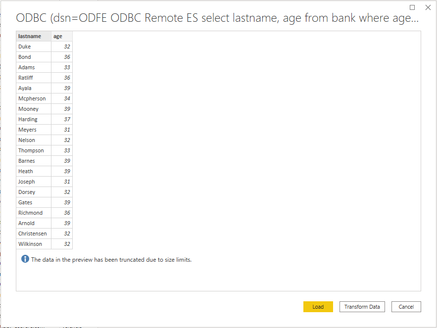

#  Connecting Open Distro For ElasticSearch to Microsoft Power BI Desktop

## Prerequisites
* Microsoft Power BI Desktop
* [Open Distro for Elasticsearch](https://opendistro.github.io/for-elasticsearch-docs/docs/install/)
* [Open Distro for Elasticsearch SQL ODBC driver](https://opendistro.github.io/for-elasticsearch-docs/docs/sql/odbc/)
* [OdfeSqlOdbcPBIConnector.mez](../../src/PowerBIConnector/bin/Release/) 
* Optional: [odfesqlodbc_import.pbids](../../src/PowerBIConnector/PBIDSExamples) to help with repeated connections to the same server 

## Setup
* Copy `OdfeSqlOdbcPBIConnector.mez` file to the `<User>\Documents\Power BI Desktop\Custom Connectors\` folder. This will let Power BI access custom connector. If you have installed the On-premises data gateway, you should be able to see the ODBC is detected as a custom connector in the **Connectors** tab.
  


## Load Data By Import

* Open Power BI Desktop.

* Disable parallel loading of tables. Click on **Files** > **Options and settings** > **Options** > **CURRENT FILE** > **Data Load** > Deselect **Enable parallel loading of tables** and click **OK**.


* Click on **Home** > **Get Data** > **More** > **Other**. Select **ODBC**. Click on **Connect**.


* If you are running the ES instance in localhost, select the default **ODFE SQL ODBC DSN** as the data source.



* Click on **OK**. Select authentication option. Enter credentials if required and click on **Connect**.



* You can also connect a remote ES instance as the data source by manually adding the DSN and authentication options through **ODBC Data Source Administrator**. Select the DSN you configured in the administrator, and click **OK**.



* Select required table. Data preview will be loaded.


* Click on **Load**.

* Select required columns for creating graph.


## Load Data By Query

* Direct query is supported to load data now. When selecting the DSN, expand the **Advanced options** and write your SQL query in the `SQL statement (optional)` field.

 

* Click **OK** and you will get a preview with resulted data set. Then click **Load** to load the result table.



## Using .PBIDS Files

More info: https://docs.microsoft.com/en-us/power-bi/connect-data/desktop-data-sources#using-pbids-files-to-get-data

Example PBIDS file for Open Distro for Elasticsearch: (available here: [odfesqlodbc_import.pbids](../../src/PowerBIConnector/PBIDSExamples/odfesqlodbc_import.pbids))
```json
{
    "version": "0.1",
    "connections": [
        {
            "details": {
                "protocol": "odfesqlodbc",
                "address": {
                    "server": "localhost:9200"
                }
            },
            "mode": "Import"
        }
    ]
}
```

The only part you should change is the `server` attribute, to point to the location of your ODFE server.
* For AWS connections, this will be the full path of your ODFE instance (ex: `https://aws-odfe-instance.us-west-1.com`).
* Otherwise, this will be the `host:port` combination for your instance (ex: `localhost:9200`).

Save this as a `.pbids` file. Double-click on it to open up your connection in Power BI Desktop.
It will take you straight to the **Navigator** window for selecting the tables from the ODFE server.
* If this is the first time you are connecting to this instance, you will be prompted for your credentials.


## Troubleshooting 

* If you get an following error, please install [Open Distro For Elasticsearch SQL ODBC Driver](https://opendistro.github.io/for-elasticsearch/downloads.html#connect).


* If you get an following error,


1. Check if host and port values are correct.
2. Check if auth credentials are correct.
3. Check if server is running.

