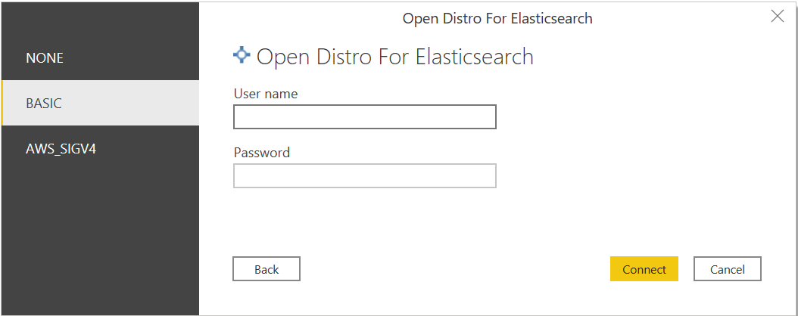

#  Connecting Open Distro For ElasticSearch to Microsoft Power BI Desktop

## Prerequisites
* Microsoft Power BI Desktop
* [Open Distro for Elasticsearch](https://opendistro.github.io/for-elasticsearch-docs/docs/install/)
* [Open Distro for Elasticsearch SQL ODBC driver](https://opendistro.github.io/for-elasticsearch-docs/docs/sql/odbc/)
* [OdfeSqlOdbcPBIConnector.mez](../../src/PowerBIConnector/bin/Release/) 

## Setup
* Copy `OdfeSqlOdbcPBIConnector.mez` file in the `<User>\Documents\Power BI Desktop\Custom Connectors\` folder. This will let Power BI access custom connector.
* Open Power BI Desktop.
* Change the security settings. Click on **Files** > **Options and settings** > **Options** > **Security** > Select **Allow any extension to load without validation or warning** for Data Extensions. This will allow the custom connector to load data into Power BI.

* Restart Power BI Desktop.

## Load Data

> **NOTE**: Currently only import mode is supported. Direct query support will be added soon.

* Open Power BI Desktop.

* Disable parallel loading of tables. Click on **Files** > **Options and settings** > **Options** > **CURRENT FILE** > **Data Load** > Deselect **Enable parallel loading of tables** and click **OK**.

* Click on **Home** > **Get Data** > **More** > **Other**. Select **Open Distro For Elasticsearch (Beta)**. Click on **Connect**.

* You will get a warning for using third-party service. Click on **Continue**.

* Enter server value. Click on **OK**.

* Select authentication option. Enter credentials if required and click on **Connect**.

* Select required table. Data preview will be loaded.

* Click on **Load**.

* Select required columns for creating graph.

## Troubleshooting 

* If you get an following error, please install [Open Distro For Elasticsearch SQL ODBC Driver](https://opendistro.github.io/for-elasticsearch-docs/docs/sql/odbc/).

* If you get an following error,

1. Check if host and port values are correct.
2. Check if auth credentials are correct.
3. Check if server is running.

