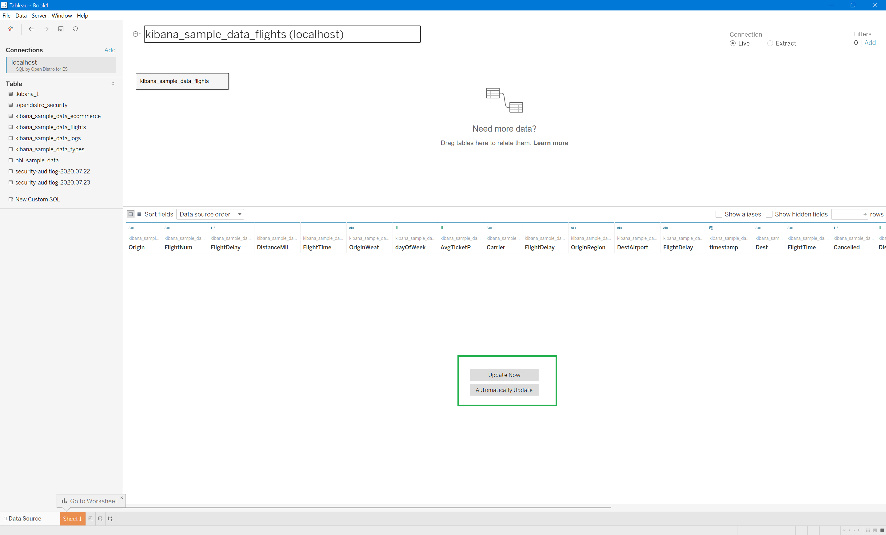

# Connecting Open Distro For ElasticSearch to Tableau Desktop via the Tableau Connector

## Overview

Connect an Open Distro For ElasticSearch data source to Tableau Desktop via the Tableau Connector to create a basic graph.

## Prerequisites

* Download and Install [Tableau Desktop](https://www.tableau.com/products/desktop/download) 2020 and higher
* Install and Configure [Open Distro for Elasticsearch](https://opendistro.github.io/for-elasticsearch-docs/docs/install/)
* Download and Install [Open Distro for Elasticsearch SQL ODBC driver](../../README.md)
* Download Tableau Connector for `SQL by Open Distro for ES` ([odfe_sql_odbc.taco](../../src/TableauConnector/odfe_sql_odbc/odfe_sql_odbc.taco)).
Click on **Download** option for downloading `odfe_sql_odbc.taco` file.


## Prepare data 

* Copy `odfe_sql_odbc.taco` file to My Tableau Repository.

  * On windows: **%User%/Documents/My Tableau Repository/Connectors/**.
  * On Mac: **~/Documents/My Tableau Repository/Connectors/**.

* Open Tableau using following command

```
<full-Tableau-path>\bin\tableau.exe -DDisableVerifyConnectorPluginSignature=true
```

* Click on **Connect** > **More** > **SQL by Open Distro for ES**.


* Enter **Server** & **Port** value. 
* Select required authentication option. For **AWS_SIGV4** authentication, select **Integrated Authentication** and enter value for **Region**.
* Use **Additional Options** section for specifying options like **FetchSize**, **ResponseTimeout**. Use `;` to separate values. For example,

```
FetchSize=2000;ResponseTimeout=20;
```


* Click on **Sign In**.
* You will get a list of tables when the connection is successful.


## Analyze Data

To generate a graph,

* Double click on any required table from the list and click on **Update Now** to load data preview.



* Data preview will be loaded.


* Click on **Sheet 1**. You can see a list of attributes under section **Data**.


* Double click on any required attributes to generate a simple graph. 


* You can change visualizations by selecting any active visualization from **Show Me**.