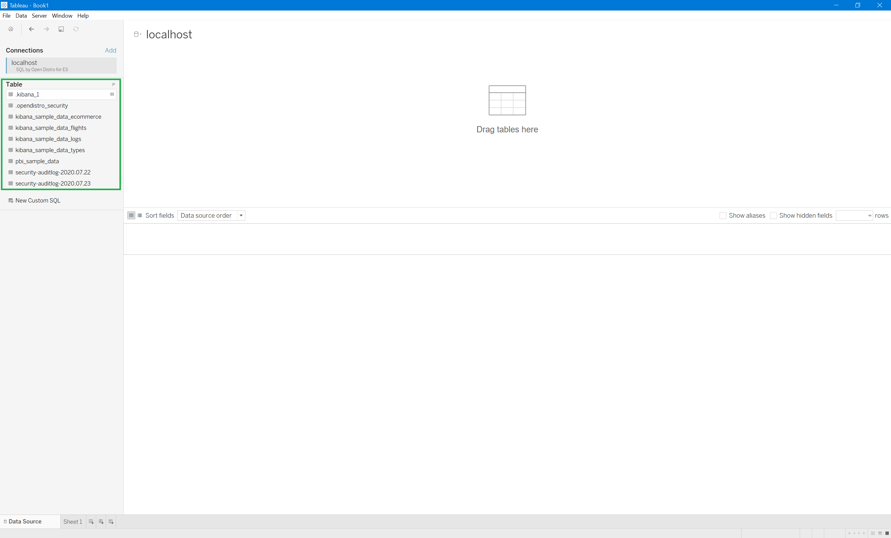
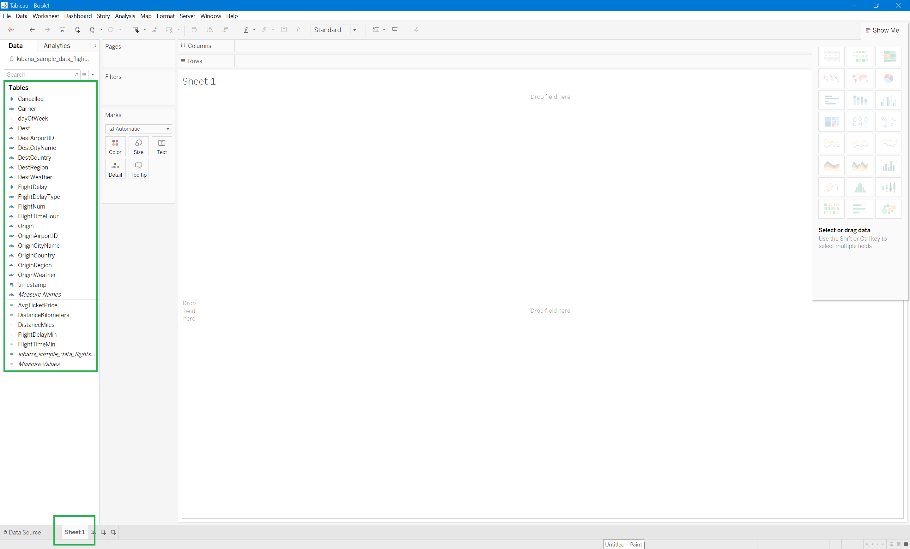

# Tableau Desktop

## Prerequisites

* Download and Install [Tableau Desktop](https://www.tableau.com/products/desktop/download) 2020 and higher
* Install and Configure [Open Distro for Elasticsearch](https://opendistro.github.io/for-elasticsearch-docs/docs/install/)
* Download and Install [Open Distro for Elasticsearch SQL ODBC driver](../../README.md)
* Download Tableau Connector for `SQL by Open Distro for ES` ([odfe_sql_odbc.taco](../../src/TableauConnector/odfe_sql_odbc/odfe_sql_odbc.taco)).

## Setup 

* Copy `odfe_sql_odbc.taco` file to **<User>/Documents/My Tableau Repository/Connectors**.
* Open Tableau using following command

```
<full-Tableau-path>\bin\tableau.exe -DDisableVerifyConnectorPluginSignature=true
```

## Prepare data 

* Click on **Connect** > **More** > **SQL by Open Distro for ES**.


* Enter **Server** & **Port** value. 
* Select required authentication option. For **AWS_SIGV4** authentication, select **Integrated Authentication** and enter value for **Region**.
* Use **Additional Options** section for specifying options like **FetchSize**, **ResponseTimeout**. Use **;** to separate values.

```
FetchSize=2000;ResponseTimeout=20;
```


* Click on **Sign In**.
* You will get a list of tables.



## Analyze Data

* Drag any required table.


* Click on **Update Now** to load data preview.


* Click on **Sheet 1**.



* Generate graph by dragging any required attributes to **Columns** & **Rows**.


* You can change visualizations by selecting any active visualization from **Show Me**.