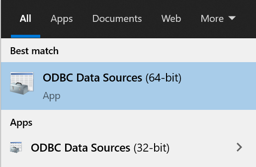
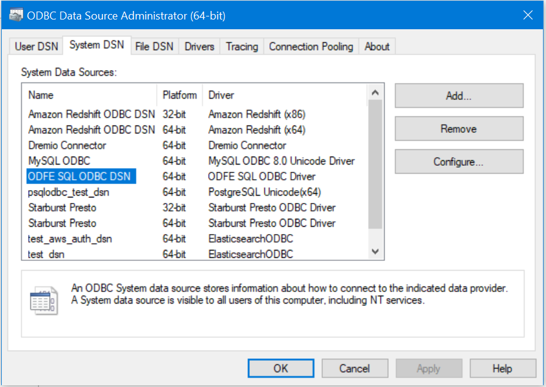
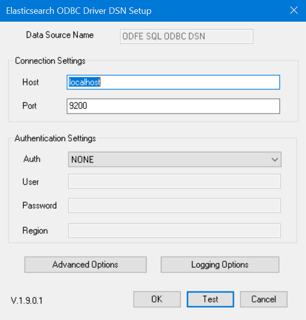
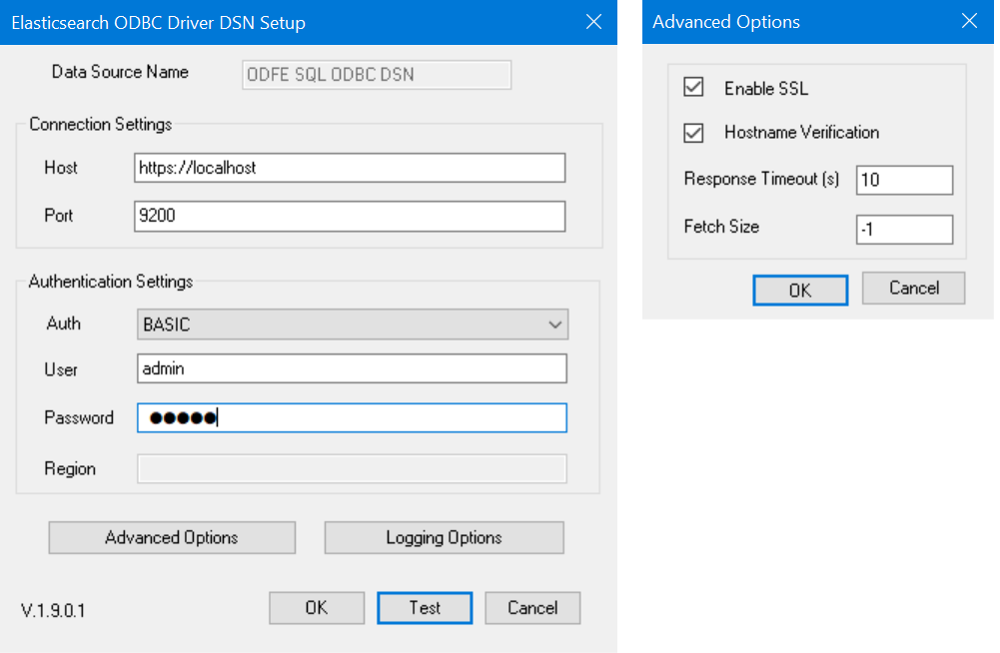
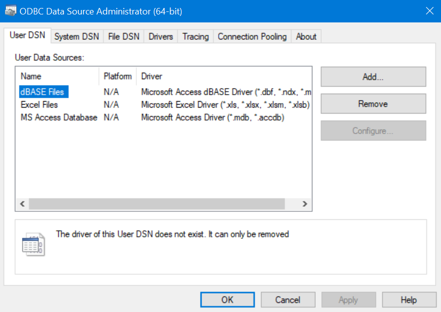
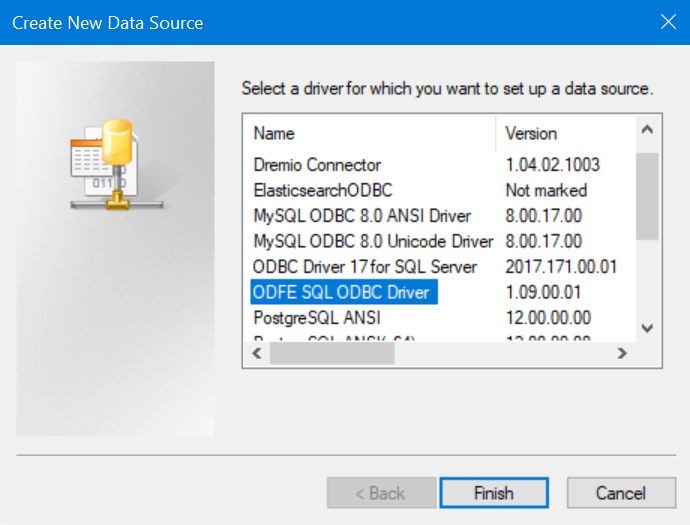
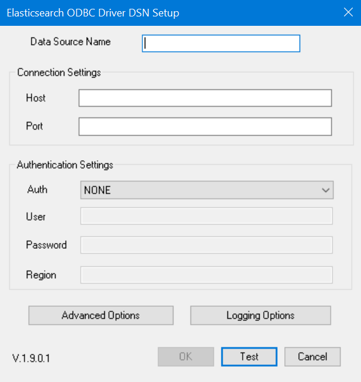
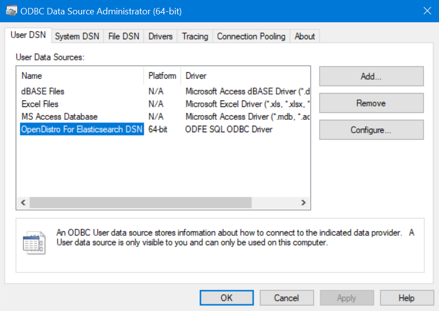

# Configuring a DSN on Windows

## Test Default Connection

1. Open ODBC Data Source Administrator.

 

2. Click on the `System DSN` tab. Select `ODFE SQL ODBC DSN` and click on `Configure`.

 

3. DSN Setup window will open with default values for [configuration options](./configuration_options.md).

 

4. Change values of configuration options accordingly.

For example, if you can connect to server using following curl command

 `curl -XGET https://localhost:9200 -u admin:admin`.

 The DSN configuration options can be set as shown below

 

> **NOTE**: For encrypted connection, the `Host` needs to be prefaced with `https://` and `Enable SSL` in Advanced Options should be checked.

5. Click on `Test` to verify connectivity. You will get a message as `Connection successful`.

 

6. Click on `OK` to save DSN values.

## Add User DSN

1. Open ODBC Data Source Administrator. Click on `User DSN` > `Add`.

 

2. Select `ODFE SQL ODBC Driver` and click on `Finish`.

 

3. The DSN Setup window will open.

 

4. Update values of configuration options.
5. Click on `Test` to verify connectivity.
6. Click on `OK` to save DSN values. 
7. You will find this newly added DSN in User DSN list.

 
    
